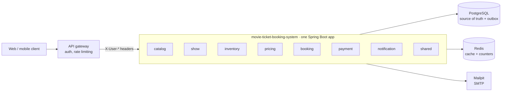
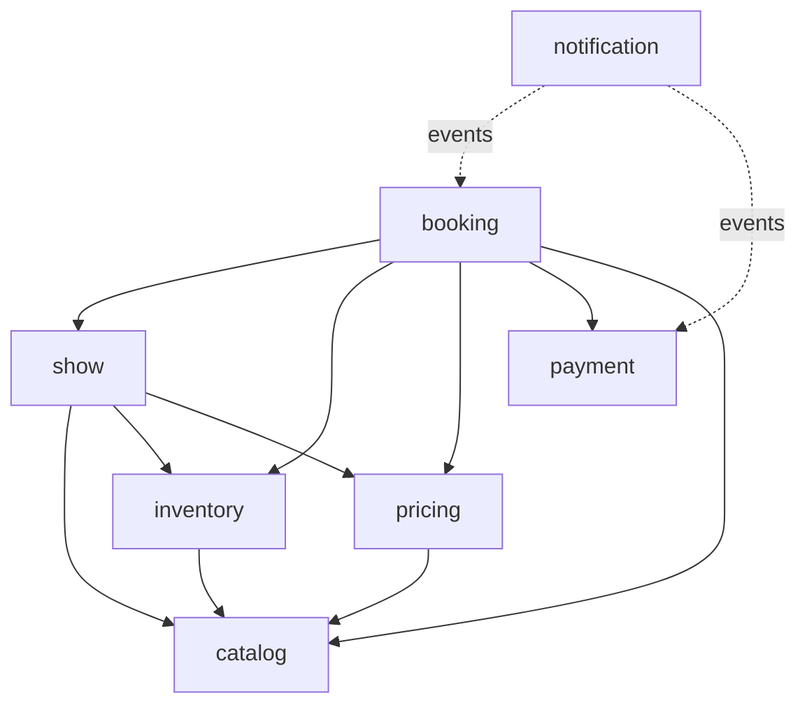

# movie-ticket-booking-system

A movie ticket booking backend: customers browse shows in their city, hold seats, pay, cancel and get
refunded; admins run the catalog, prices, coupons and refund policies. The hard part isn't the CRUD, it's
selling each seat exactly once while hundreds of people click at the same moment, on several app instances,
with payments that fail, arrive late or never arrive at all.

Java 21 · Spring Boot 4.1 · Spring Modulith 2.1 · PostgreSQL 17 · Redis 7 · Flyway · Testcontainers

## What it does

- **Browse:** cities, movies now showing, a date strip, theaters with showtimes (filter by time slot,
  language, format), a live seat map. Cached in Redis, with a seats-left counter per show.
- **Hold:** pick up to 10 seats and they're yours for 8 minutes. All or nothing, and no seat is ever sold twice.
- **Price:** tier price per seat category, day-of-week rules, coupons (flat or percentage, limits per coupon and
  per customer), a convenience fee and GST, split per seat so partial refunds add up to the paisa.
- **Pay:** card, UPI, net banking or wallet against a simulated gateway that can succeed, decline or answer
  15 seconds later. A payment that lands after the seats were lost is refunded automatically.
- **Cancel:** all or some seats, refunded under the refund policy the booking was sold with (for example 100%
  up to 24h before, 50% up to 4h). An admin cancelling a show refunds everyone in full.
- **Notify:** confirmation, cancellation, refund and a reminder two hours before the show, by email
  (Mailpit locally) and SMS (logged), each sent exactly once.
- **Admin:** cities, theaters, screens, versioned seat layouts, movies, shows, prices, pricing rules, coupons and
  refund policies.

## Architecture

One deployable, split into modules that Spring Modulith keeps honest: `ModularityTest` fails the build on a
dependency cycle or a reference into another module's `internal` package.





Modules talk through a small public API (`ShowApi`, `InventoryApi`, `PricingApi`, `PaymentApi` …) or through
events. Events go through a transactional outbox (Spring Modulith's JDBC event publication registry), so an
email or a refund is never lost because the app stopped at the wrong moment. Running `ModularityTest` also
writes PlantUML diagrams of every module to `target/spring-modulith-docs`.

Auth lives at the gateway: the app trusts the `X-User-Id`, `X-User-Role`, `X-User-Name`, `X-User-Email` and
`X-User-Phone` headers it forwards and checks ownership itself.

## Hard problems and how they're solved

| Problem | How | Proven by |
|---|---|---|
| 500 customers grab the same seat | Seat rows locked with `FOR UPDATE NOWAIT`, then a conditional update on the one row that owns the seat | `SeatHoldConcurrencyIT`: 500 threads, 1 winner; `scripts/race.sh` across two instances |
| Two multi-seat holds overlap (A: 1,2 and B: 2,3) | Rows always locked in seat-id order | `OverlappingHoldsIT`: no deadlock, each hold all or nothing |
| A hold ran out but the sweeper hasn't run yet | Every read and claim treats a lapsed hold as free | `ExpiredHoldTakeoverIT` |
| A customer double-clicks "Hold" or "Pay" | `Idempotency-Key` replay (the client picks the key per action), plus a unique index on one live hold per customer and show | `IdempotencyIT`, `CheckoutIT`, `SameUserDoubleHoldIT` |
| The payment succeeds after the seats were given away | Separate transactions around the gateway call; confirm fails cleanly and a full refund is issued | `DelayedAndLatePaymentIT` |
| Two customers take a coupon's last use | Conditional `UPDATE … used_count < max_uses` | `CouponLimitConcurrencyIT`: 50 customers, 10 uses |
| A refund would exceed what was paid | Conditional update on `refunded_paise` plus a `CHECK` constraint | `CancellationIT` |
| Two cancels of one booking at once, or a cancel racing a show cancellation | The booking row is locked for the change | `CancellationIT`: one 200, one 409 |
| A payment completes just as the show is cancelled | Confirm locks the booking before checking the show; the show-cancel listener locks it too, so whichever runs second sees the other | `ShowCancellationIT` |
| The admin re-prices a show during a hold | Each seat's price is frozen on the booking at hold time | `CheckoutIT` |
| Two admins schedule overlapping shows | A Postgres exclusion constraint on screen and time range | `ShowAdminIT` |
| Two instances run the same scheduled job | ShedLock on the database clock | `ShedLockIT` |
| An event is delivered twice | Per-channel claim in `notification_log`, refund status checks, booking state checks | `NotificationIT`, `DelayedAndLatePaymentIT` |
| An email fails to send | The event stays incomplete and is retried every minute, up to 10 times | `EventPublicationJobsIT` |

Money is always `long` paise, time always comes from an injected `Clock`, and each table belongs to exactly
one module.

## Running it

Needs Java 21 and Docker.

```bash
docker compose up -d          # Postgres 5432, Redis 6379, Mailpit 1025 (web UI on 8025)
./mvnw spring-boot:run
```

The app connects to docker-compose's database by default. To use another one, set `DB_URL`, `DB_USERNAME`
and `DB_PASSWORD`.

Fill the empty database with sample data (2 cities, 4 theaters, 5 movies, a week of shows). Needs `curl` and
`jq`:

```bash
./scripts/seed-local.sh
```

Then use the IntelliJ HTTP-client files in [`http/`](http), numbered in demo order, with the `local`
environment from `http/http-client.env.json`. Every email the app sends shows up at http://localhost:8025.

**Two instances and the race.** Start a second instance on another port, pick an open show and a free seat,
and fire 200 simultaneous holds at both:

```bash
./mvnw spring-boot:run -Dspring-boot.run.arguments=--server.port=8081
./scripts/race.sh 200 <showId> <seatId>
# 201: 1
# 409: 199
```

**Tests** use Testcontainers (Postgres, Redis, Mailpit), so Docker has to be running:

```bash
./mvnw verify      # unit tests, then the integration tests (*IT)
```

## Demo script (about 10 minutes)

1. **Architecture:** run `ModularityTest`; the build fails if a module reaches into another's internals.
2. **Browse:** `seed-local.sh`, then `09-browse.http` with and without `slot=EVENING,NIGHT`.
3. **The race:** `SeatHoldConcurrencyIT` (500 threads, 1 winner), then `scripts/race.sh 200` against two
   instances.
4. **Happy path:** create `FIRST50` (`08-coupons.http`), hold with it, walk through the price breakdown, pay with
   UPI, open the email in Mailpit.
5. **Failure paths:** `simulate: FAILURE` gives the seats back at once; `simulate: DELAYED` answers 202 and
   confirms about 15 seconds later.
6. **Refunds:** refund preview, partial cancellation, then the booking details with the refund's status.
7. **Admin cancels a show:** every hold released, every booking refunded in full.
8. **Background jobs:** with both instances up, only one runs the hold sweeper each round (every 30 seconds).
