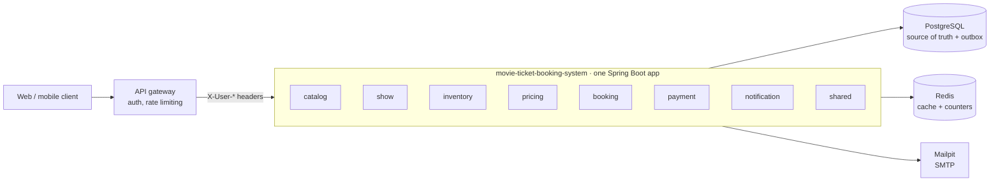
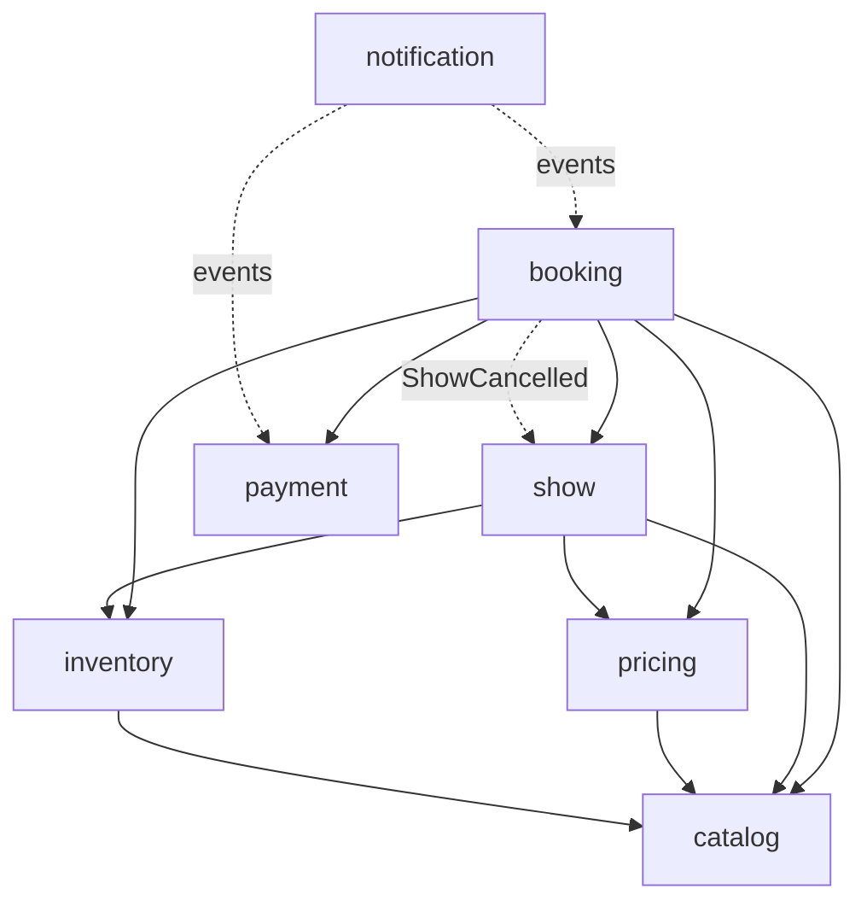

# movie-ticket-booking-system

A movie ticket booking backend: customers browse shows in their city, hold seats, pay, cancel and get
refunded; admins run the catalog, prices, coupons and refund policies. The hard part isn't the CRUD, it's
selling each seat exactly once while hundreds of people click at the same moment, on several app instances,
with payments that fail, arrive late or never arrive at all.

Java 21 · Spring Boot 4.1 · Spring Modulith 2.1 · PostgreSQL 17 · Redis 7 · Flyway · Testcontainers

- [What it does](#what-it-does)
- [Architecture](#architecture)
- [Hard problems and how they're solved](#hard-problems-and-how-theyre-solved)
- [Assumptions and the reasoning behind them](#assumptions-and-the-reasoning-behind-them)
- [Running it](#running-it)
- [Demo script](#demo-script-about-10-minutes)

## What it does

- **Browse:** cities, movies now showing, a date strip, theaters with showtimes (filter by time slot,
  language, format), a live seat map. Cached in Redis, with a seats-left counter per show.
- **Hold:** pick up to 10 seats and they're yours for 8 minutes. All or nothing, and no seat is ever sold twice.
- **Price:** tier price per seat category, day-of-week rules, coupons (flat or percentage, limits per coupon and
  per customer), a convenience fee and GST, split per seat so partial refunds add up to the paisa.
- **Pay:** card, UPI, net banking or wallet against a simulated gateway that can succeed, decline or answer
  15 seconds later. A payment that lands after the seats were lost is refunded automatically.
- **Cancel:** all or some seats, refunded under the refund policy the booking was sold with (for example 100%
  up to 24h before, 50% up to 4h). An admin cancelling a show refunds everyone in full.
- **Notify:** confirmation, cancellation, refund and a reminder two hours before the show, by email
  (Mailpit locally) and SMS (logged), each sent exactly once.
- **Admin:** cities, theaters, screens, versioned seat layouts, movies, shows, prices, pricing rules, coupons and
  refund policies.

## Architecture

One deployable, split into eight modules. Each module is a top-level package: its root package is its public
API, and everything under `internal/` is private to it.



| Module | Owns | Other modules use it through |
|---|---|---|
| catalog | cities, theaters, screens, versioned seat layouts, movies | `CatalogApi` |
| show | shows, the browse pages, the seat map | `ShowApi`; publishes `ShowCancelled` |
| inventory | every seat of every show (`show_seat`) and who holds or owns it | `InventoryApi` |
| pricing | category prices, day-of-week rules, coupons | `PricingApi`, `CouponApi` |
| booking | holds, checkout, cancellations, refund policies, history | its events (`BookingConfirmed` …) |
| payment | payments and refunds | `PaymentApi`; publishes payment and refund events |
| notification | emails and SMS, sent once each | nothing: it only listens to events |
| shared | money, time, errors, the current user, idempotency, jobs | open to every module |



**How modules talk.** A module calls another only through its public API interface (solid arrows), and only
when it needs an answer straight away, like a hold needing the price and the seats. When something has
happened and others should react, the module publishes an event instead (dotted arrows): payment never calls
booking, it publishes `PaymentSucceeded`. So every arrow points "down" and there are no cycles.

**The boundaries are enforced.** `ModularityTest` fails the build if a module imports another module's
`internal` package or a cycle appears. Each module's `package-info.java` also lists the modules it may depend
on (`@ApplicationModule(allowedDependencies = …)`), so even a new dependency without a cycle fails the build
until it's added there on purpose. Running `ModularityTest` also writes PlantUML diagrams of every module to
`target/spring-modulith-docs`.

**Inside a module**, a request goes controller (HTTP ↔ DTO only) → service (the transaction boundary) →
aggregate (state machine and rules) → repository. Contended writes (seat claims, coupon limits, refunds) are
hand-written conditional SQL through `JdbcClient`; the rest is Spring Data JPA.

**Paying is three short transactions, not one.** First the booking moves to `PAYMENT_PENDING` and the payment
is recorded. Then the gateway is called with no transaction open, so a slow bank never holds a database lock.
Finally the booking is confirmed, or failed; if the seats were lost meanwhile, it's closed and refunded in full.

**Events go through a transactional outbox** (Spring Modulith's JDBC event publication registry): each event is
written to `event_publication` in the same transaction as the change that caused it, then delivered after
commit. A confirmation email or a refund can't be lost because the app stopped at the wrong moment; a failed
delivery is retried every minute and after a restart.

**Auth lives at the gateway.** The app trusts the `X-User-Id`, `X-User-Role`, `X-User-Name`, `X-User-Email` and
`X-User-Phone` headers it forwards, and checks ownership and admin paths itself.

## Hard problems and how they're solved

| Problem | How | Proven by |
|---|---|---|
| 500 customers grab the same seat | Seat rows locked with `FOR UPDATE NOWAIT`, then a conditional update on the one row that owns the seat | `SeatHoldConcurrencyIT`: 500 threads, 1 winner; `scripts/race.sh` across two instances |
| Two multi-seat holds overlap (A: 1,2 and B: 2,3) | Rows always locked in seat-id order | `OverlappingHoldsIT`: no deadlock, each hold all or nothing |
| A hold ran out but the sweeper hasn't run yet | Every read and claim treats a lapsed hold as free | `ExpiredHoldTakeoverIT` |
| A customer double-clicks "Hold" or "Pay" | `Idempotency-Key` replay (the client picks the key per action), plus a unique index on one live hold per customer and show | `IdempotencyIT`, `CheckoutIT`, `SameUserDoubleHoldIT` |
| The payment succeeds after the seats were given away | Separate transactions around the gateway call; confirm fails cleanly and a full refund is issued | `DelayedAndLatePaymentIT` |
| Two customers take a coupon's last use | Conditional `UPDATE … used_count < max_uses` | `CouponLimitConcurrencyIT`: 50 customers, 10 uses |
| A refund would exceed what was paid | Conditional update on `refunded_paise` plus a `CHECK` constraint | `CancellationIT` |
| Two cancels of one booking at once, or a cancel racing a show cancellation | The booking row is locked for the change | `CancellationIT`: one 200, one 409 |
| A payment completes just as the show is cancelled | Confirm locks the booking before checking the show; the show-cancel listener locks it too, so whichever runs second sees the other | `ShowCancellationIT` |
| The admin re-prices a show during a hold | Each seat's price is frozen on the booking at hold time | `CheckoutIT` |
| Two admins schedule overlapping shows | A Postgres exclusion constraint on screen and time range | `ShowAdminIT` |
| Two instances run the same scheduled job | ShedLock on the database clock | `ShedLockIT` |
| An event is delivered twice | Per-channel claim in `notification_log`, refund status checks, booking state checks | `NotificationIT`, `DelayedAndLatePaymentIT` |
| An email fails to send | The event stays incomplete and is retried every minute, up to 10 times | `EventPublicationJobsIT` |

Money is always `long` paise, time always comes from an injected `Clock`, and each table belongs to exactly
one module.

## Assumptions and the reasoning behind them

The brief left these open, so each one is a deliberate choice. Most numbers live under `booking.*` in
`src/main/resources/application.yml` and can be changed without touching code; the last column says where.

### Scope and users

| Assumption | Why | Where |
|---|---|---|
| One country: prices in Indian rupees, GST, cities default to `Asia/Kolkata` | The brief's GST and fees are Indian; supporting several currencies would double every pricing and refund rule for no v1 benefit. Each city still carries its own time zone | city `timezone` (admin API) |
| Two roles only: ADMIN and CUSTOMER | Those are the roles the brief names. A theater-owner role with its own scope would need row-level permissions everywhere | `X-User-Role` |
| No sign-up or login inside this service; a gateway authenticates and forwards who the caller is as `X-User-*` headers | Login, sessions and rate limiting belong at the edge. The service still checks **ownership** itself, because the gateway can't know who owns a booking. It follows that the service must never be exposed without the gateway | `CurrentUserInterceptor` |
| A customer's name, email and phone come from those headers and are kept in `app_user` | Background work (emails, reminders) runs long after the request is gone, so it needs somewhere to look them up. A customer who never sent an email gets no email | `UserDirectory` |
| English only, no localisation | Nothing in the brief asks for it, and it touches every message and template | Thymeleaf templates |
| Out of scope for v1: compliance work, observability, delivery pipelines, real third-party integrations, waitlists, live push of seat changes | v1 is about the core problems (concurrency, holds, payments, refunds, events) solved properly; each of these is a project of its own | |

### Holds and bookings

| Assumption | Why | Where |
|---|---|---|
| A hold lasts **8 minutes** | Long enough to enter card details, short enough that an abandoned cart doesn't keep seats off sale for long | `hold-duration` |
| Starting to pay keeps the seats at least **5 more minutes**, and never shortens a longer hold | A customer who taps Pay at 7:59 shouldn't lose the seats while the bank thinks | `payment-window` |
| An unanswered payment gets **2 more minutes** of grace before the sweeper expires it | Slow UPI approvals are common; expiring too early would just turn them into refunds | `payment-grace` |
| At most **10 seats** per booking, and **one live hold per customer per show** | Stops one person hoarding a show, and keeps the flow simple: finish or release one hold before starting another | `max-seats-per-booking`, `booking_one_active_hold` index |
| A hold is **all or nothing** | A group booking half its seats is worse than a clear "those seats are gone, pick again" | `InventoryApi.hold` |
| Sales close **10 minutes** before the show; customer cancellations close **30 minutes** before | Late sales risk people missing the start; late cancellations leave seats that can't realistically be resold | `booking-cutoff`, `cancellation-cutoff` |
| A lapsed hold is free the moment it expires; the 30-second sweeper only tidies up | Correctness can't depend on a job running on time. The sweeper exists to free coupons and correct the seats-left counter | `HoldExpiryJob` |
| A declined payment is final: the booking fails, the seats go back, the customer holds again | A smaller state machine than retrying payment on the same booking, and the seats aren't kept away from others while a customer fixes their card | `Booking.fail` |
| A seat's price is **frozen at hold time** | The customer pays what they were shown, even if an admin changes prices a minute later | `booking_seat` amounts |
| Show "closed for booking" is worked out from the start time, not stored | No job needed to close shows, and no chance of a show staying open because one didn't run | `ShowDetails.isBookable` |

### Money, pricing and tax

| Assumption | Why | Where |
|---|---|---|
| Money is a whole number of **paise** in a `long` | No floating point anywhere near money; rounding is explicit and half-up, per seat | `Money` |
| Price per seat = category price (the show's override, else the theater's default), plus a day-of-week surcharge, minus its share of the coupon, plus a **₹20** convenience fee, plus **18% GST** on the ticket after discount and on the fee | Matches how cinemas quote prices. A single 18% rate simplifies real ticket GST, which has more than one slab; the rate is one setting | `convenience-fee-paise`, `gst-percent` |
| Three seat categories: REGULAR, PREMIUM and RECLINER | Covers the tiers the brief mentions. Categories are seed data, so a fourth is a migration, not a code change | `seat_category` |
| Day-of-week rules are **surcharges only**; one rule applies per show, and the most specific wins (theater, then city, then global) | Discounts already come from coupons; allowing both to lower a price makes the final number hard to explain. A **Weekend +20%** rule is seeded | pricing rules (admin API) |
| One coupon per booking; its discount is split across the seats in proportion to their price | Partial cancellations then refund exactly each seat's share of the discount, and the seats always add up to the total | `DiscountRule`, `Allocator` |
| A coupon use comes back on expiry, a declined payment or a **full** cancellation, but not a partial one | Simple to explain: the coupon was used as long as any seat of the booking was | `CouponApi.release` |
| Coupons are limited per coupon (`maxUses`) and per customer (`perUserLimit`, default 1), both enforced atomically | "First 50 customers" promotions must never go to the 51st, even when many redeem at the same instant | coupon admin API |

### Payments and refunds

| Assumption | Why | Where |
|---|---|---|
| The payment gateway is **simulated**; the request chooses the outcome: success, decline, or success about **15 seconds** later | Every failure path (declines, slow banks, late payments) can be shown and tested without a real provider. A real one would be another `PaymentProcessor` | `simulate` in the pay request, `payment.simulated-delay` |
| A delayed answer is held only in memory | A restart loses it, and the sweeper then expires the booking. Acceptable for a simulator; a real gateway would call back through a webhook | `PaymentFacade` |
| Card details are validated (Luhn, expiry, CVV) but never stored; the payment keeps a masked form only | Nothing in this service should ever be in scope for card-data rules | `PaymentDetails` |
| Refunds go back to the original payment method and, in the simulator, always succeed | That's how real refunds work; a failing refund is still recorded as FAILED and logged | `RefundExecutor` |
| Each booking keeps a **copy of the refund policy** it was sold under | Editing a policy must never change what an existing customer was promised | `refund_policy_snapshot` |
| The default policy: **100%** of the ticket price 24 hours or more before the show, **50%** from 4 hours, nothing after; the convenience fee is kept. Only whole hours count, so 23h59m is 23 | A common cinema policy, easy to state to a customer. Admins can create others (including full-refund and non-refundable ones) and pick one per show | refund policies (admin API) |
| An admin cancelling a show refunds **everything, fees included**, whatever the policy | It isn't the customer's decision, so no policy should cost them money | `FullRefundRule` |
| A payment that succeeds after its seats were lost is **refunded in full automatically** | Nobody should ever pay for a seat they don't get, and no one should have to ask for it back | `CheckoutService` |

### Time and the browse pages

| Assumption | Why | Where |
|---|---|---|
| Times are stored in UTC and shown in the city's time zone | One unambiguous clock in the database; local time only at the edges | `timestamptz` columns |
| A show starting before **03:00** is listed under the previous day | To the audience, a 00:30 show is part of the previous evening. An admin can override the listing date | `late-night-cutoff`, `showDate` |
| Time-of-day filters: Morning 03:00–12:00, Afternoon 12:00–16:00, Evening 16:00–20:00, Night 20:00–03:00 | Night ends at 03:00 so late-night shows fall under it | `slots` |
| **20 minutes** of cleaning time after every show before the screen can host the next | Screens need turning around; the no-overlap rule includes it | `cleaning-buffer` |
| Customers can browse **7 days** ahead; a show is "filling fast" below **20%** of seats left | Typical for cinema listings | `date-strip-days`, `filling-fast-percent` |
| A reminder goes out about **2 hours** before the show | Late enough to be useful, early enough to still get there | `reminder-lead-time` |

### Scale, infrastructure and consistency

| Assumption | Why | Where |
|---|---|---|
| **PostgreSQL decides every outcome**; Redis only speeds up reads | Correctness must never depend on a cache. If Redis is down, reads fall back to the database and nothing fails | `SeatCounter`, `CachingShowQueryService` |
| One Postgres primary | Row locks and constraints need one authoritative copy; read replicas could serve browsing later | |
| Several app instances may run at once | Seat safety comes from the database, not the process, and scheduled jobs take a ShedLock lock on the database clock so only one instance runs each round | `SchedulingConfig` |
| A show has at most a few hundred bookings | Cancelling a show loads all its booking ids at once; paging would be needed for much larger venues | `ShowCancelledListener` |
| Events are delivered **at least once**, so every listener is safe to run twice | The outbox guarantees delivery, not uniqueness: emails are de-duplicated per channel, refunds check their status, bookings check their state | `notification_log`, `RefundExecutor` |
| No message broker yet | Nothing outside the app consumes events. The outbox can publish to Kafka later without changing the publishers | `event_publication` |
| The client makes a new `Idempotency-Key` per action and reuses it only to retry that action; keys are kept **24 hours** | Retries after a dropped response are safe without the server guessing what counts as "the same request" | `@Idempotent`, `idempotency-retention` |
| Admins are trusted: no approval workflow, and nothing is ever hard-deleted | Deactivating keeps every booking's history intact; approvals are a v2 concern | `deactivate` endpoints |

### Notifications

| Assumption | Why | Where |
|---|---|---|
| Email over plain SMTP (Mailpit locally); SMS only written to the log | Real HTML emails in development with no setup. An SMS provider is just another notification channel | `EmailChannel`, `SmsChannel` |
| Notifications are sent after the change commits, never inside it | A slow mail server must never slow down or roll back a booking | `NotificationListener` |

## Running it

### Prerequisites

- **Java 21** (the Maven wrapper downloads Maven itself)
- **Docker**, for the local Postgres, Redis and Mailpit, and for the tests
- `curl` and `jq`, only for the sample-data script

### Start it

```bash
docker compose up -d          # Postgres on 5432, Redis on 6379, Mailpit on 1025 (web UI on 8025)
./mvnw spring-boot:run        # the API on http://localhost:8080
```

Flyway creates the schema on the first start. The database is empty apart from the seed data the migrations
carry: the three seat categories, the Weekend +20% rule and the Standard refund policy.

To fill it with sample data (2 cities, 4 theaters, 5 movies and a week of open shows):

```bash
./scripts/seed-local.sh
```

### Try it

- **Requests:** the IntelliJ HTTP-client files in [`http/`](http), numbered in demo order, with the `local`
  environment from `http/http-client.env.json`.
- **Who you are:** every request needs `X-User-Id` (a UUID) and `X-User-Role` (`ADMIN` or `CUSTOMER`), as the
  gateway would send them. Add `X-User-Email` to receive emails.
- **Emails:** everything the app sends appears at http://localhost:8025.

| Address | What |
|---|---|
| http://localhost:8080/api/v1 | The API |
| http://localhost:8025 | Mailpit: every email sent |
| localhost:5432 | Postgres (`moviebooking` / `moviebooking`) |
| localhost:6379 | Redis |

### Configuration

| Setting | Default | Change it to |
|---|---|---|
| `DB_URL`, `DB_USERNAME`, `DB_PASSWORD` | docker-compose's database | point at another Postgres |
| `SERVER_PORT` | 8080 | run a second instance |
| `SPRING_DATA_REDIS_HOST`, `SPRING_DATA_REDIS_PORT` | localhost, 6379 | use another Redis |
| `SPRING_MAIL_HOST`, `SPRING_MAIL_PORT` | localhost, 1025 | send through another SMTP server |
| `JOBS_ENABLED` | true | stop the scheduled jobs on an instance |

Business rules (hold time, cutoffs, fees, GST …) are under `booking.*` in `application.yml`; see the
assumptions above.

### Two instances and the race

Start a second instance on another port, pick an open show and a free seat, and fire 200 simultaneous holds at
both:

```bash
SERVER_PORT=8081 ./mvnw spring-boot:run
./scripts/race.sh 200 <showId> <seatId>
# 201: 1
# 409: 199
```

### Tests

```bash
./mvnw verify      # 105 unit tests, then 143 integration tests (*IT)
```

The integration tests start their own Postgres, Redis and Mailpit with Testcontainers, so Docker has to be
running; nothing else is needed, and they don't touch the docker-compose database.

### Troubleshooting

| Symptom | Cause and fix |
|---|---|
| `docker compose up` fails with "port 5432 is already allocated" | A Postgres installed on the machine is using the port. Stop it, or keep it and point the app at it with `DB_URL`, `DB_USERNAME` and `DB_PASSWORD` |
| The app fails at start with a Flyway "checksum mismatch" | An already-applied migration file was edited. Migrations are never changed once applied: revert the edit and add a new migration |
| Tests fail with "Could not find a valid Docker environment" | Docker isn't running |
| No email arrives | The request had no `X-User-Email`, or Mailpit isn't running (`docker compose ps`) |

## Demo script (about 10 minutes)

1. **Architecture:** run `ModularityTest`; the build fails if a module reaches into another's internals.
2. **Browse:** `seed-local.sh`, then `09-browse.http` with and without `slot=EVENING,NIGHT`.
3. **The race:** `SeatHoldConcurrencyIT` (500 threads, 1 winner), then `scripts/race.sh 200` against two
   instances.
4. **Happy path:** create `FIRST50` (`08-coupons.http`), hold with it, walk through the price breakdown, pay with
   UPI, open the email in Mailpit.
5. **Failure paths:** `simulate: FAILURE` gives the seats back at once; `simulate: DELAYED` answers 202 and
   confirms about 15 seconds later.
6. **Refunds:** refund preview, partial cancellation, then the booking details with the refund's status.
7. **Admin cancels a show:** every hold released, every booking refunded in full.
8. **Background jobs:** with both instances up, only one runs the hold sweeper each round (every 30 seconds).
