# Diagrams

Entity-relationship, state and flow diagrams of the movie ticket booking system, drawn from the code and the migrations. GitHub renders the Mermaid blocks. The talking points under each diagram are a script for explaining it.

## Architecture

### System context

One Spring Boot deployable behind a gateway, with Postgres as the source of truth.

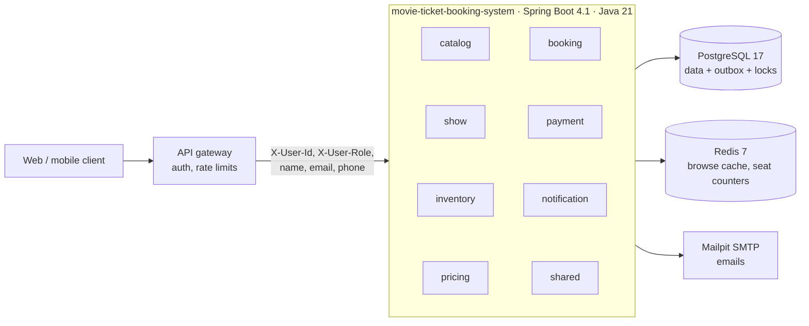

- A modular monolith: one deployable, eight modules, each owning its own tables.
- Auth lives at the gateway; the app trusts the forwarded X-User headers and checks ownership itself.
- Postgres is the only source of truth: seats, money, the event outbox and the job locks all live there.
- Redis is a cache and a counter only. Losing it loses nothing.

### Module dependencies

Spring Modulith verifies this graph on every build: no cycles, no reaching into another module's internals.

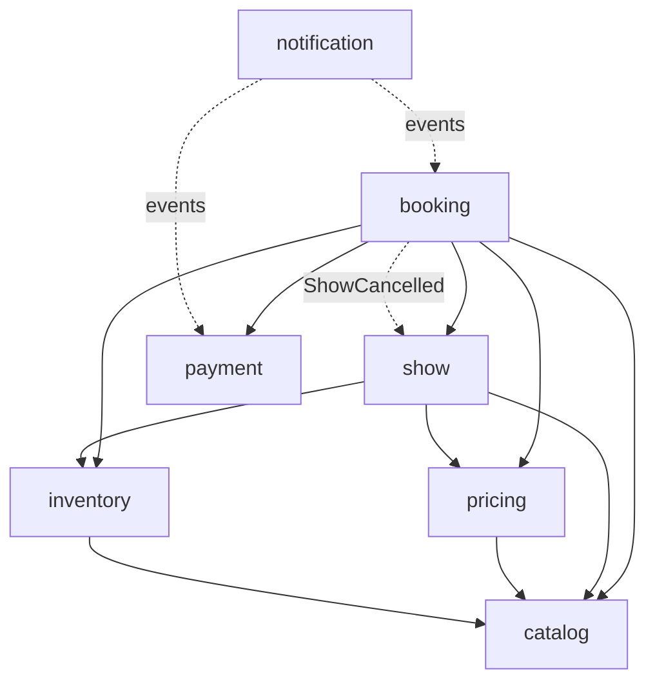

- Arrows are compile-time calls through a small public API such as InventoryApi or PaymentApi.
- Dotted arrows are events through the outbox: notification never calls back into booking.
- ModularityTest fails the build on a cycle or an import from another module's internal package.
- Splitting a module into a service later is mostly moving its package: events already go over an outbox.

### Request path

Every request takes the same layers; the contended SQL is hand-written, the rest is JPA.

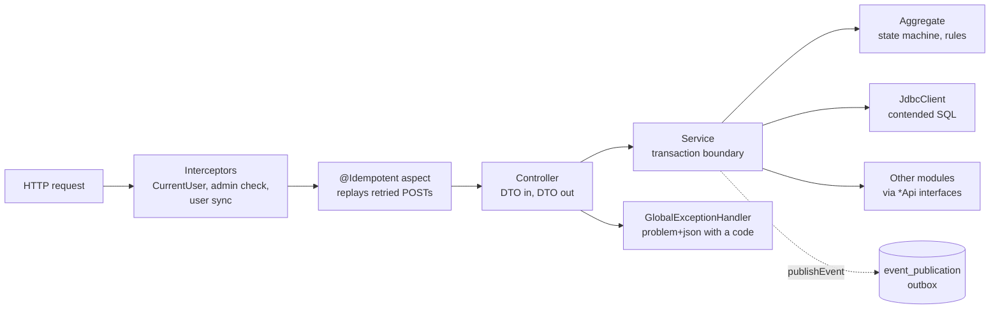

- Controllers only map HTTP; services own the transaction; aggregates own the rules.
- Seat claims, coupon limits and refunds use hand-written SQL with conditional updates.
- Errors are RFC 9457 problem+json with a stable code the client can branch on.

## Data model

### Entity relationships at a glance

Every business table and how they connect; the platform tables have their own diagram. Dashed lines are references by id across module boundaries, with no foreign key.

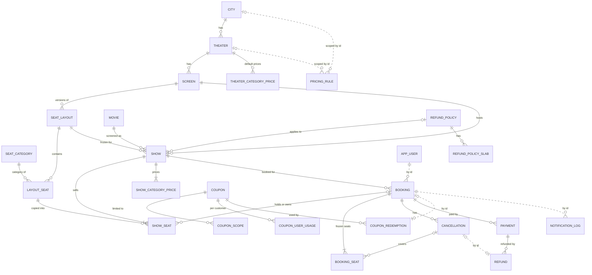

- Catalog on top, the per-show copy in the middle, bookings and money at the bottom.
- A show freezes its layout version: show_seat is a copy, so editing a screen never touches sold seats.
- The booking freezes its price per seat in booking_seat; later price changes don't touch it.
- Dashed links cross module boundaries by id only: modules never share foreign keys.

### Catalog, shows and seats

Where things are, what's on, and every seat of every show.

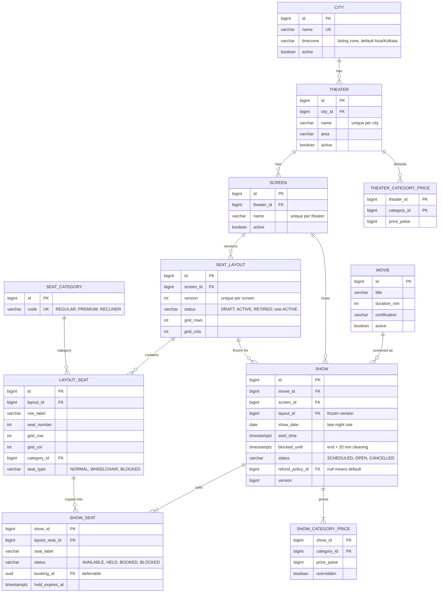

- show_no_overlap is a Postgres exclusion constraint on screen and time range: two admins can't double-book a screen.
- show_seat is the one row that owns a seat for a show. Every hold, confirm and release is a conditional update on it.
- A HELD row whose hold_expires_at has passed counts as free everywhere: lazy expiry, no sweeper needed for correctness.
- Layouts are versioned: activating a new one retires the old; existing shows keep theirs.

### Bookings, pricing and refunds

The customer's side: what they hold, what they paid, what they got back.

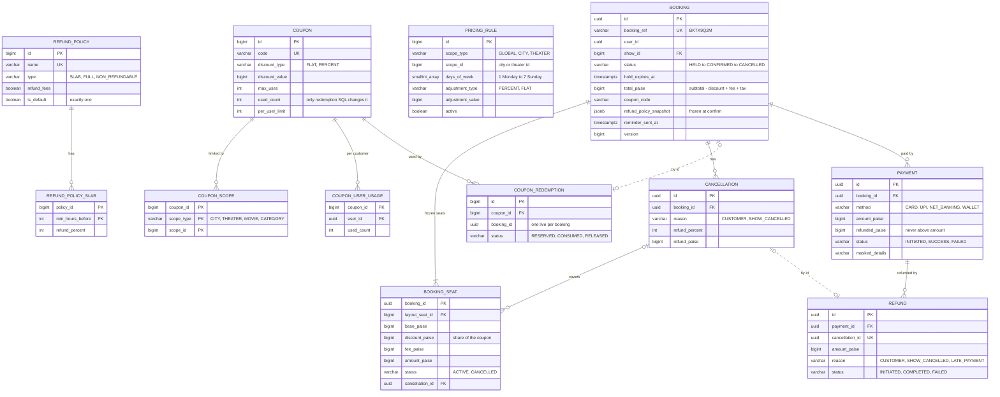

- booking_one_active_hold: a partial unique index, so a customer has at most one live hold per show.
- payment_one_success: a booking can never be charged twice, whatever the retries.
- refunded_paise has a CHECK against amount_paise: the database itself refuses to refund more than was paid.
- Each booking keeps a JSON snapshot of its refund policy, so editing a policy never changes old sales.

### Platform tables

Cross-cutting tables that make retries, events and jobs safe.

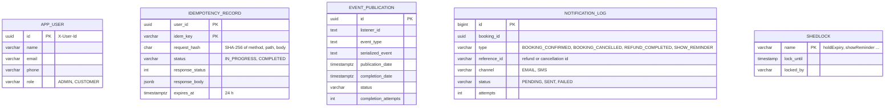

- idempotency_record: a retried POST with the same key replays the stored answer instead of doing the work twice.
- event_publication is the outbox: events are stored in the same transaction as the change, then delivered.
- notification_log has a unique key per booking, type, reference and channel: each message goes out once.
- shedlock rows make each scheduled job run on one instance per round, timed by the database clock.

## State machines

### Booking lifecycle

Every status change goes through the aggregate; anything else is an illegal transition.

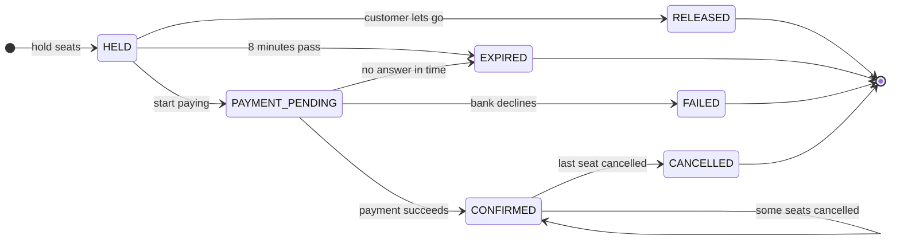

- Seats stay the customer's while HELD or PAYMENT_PENDING; starting to pay extends the hold by the payment window.
- Cancelling some seats keeps the booking CONFIRMED; it's CANCELLED only when none are left.
- An EXPIRED booking whose payment still arrives is refunded in full, automatically.

### A seat of a show

The show_seat row: one owner at a time, changed only by conditional updates.

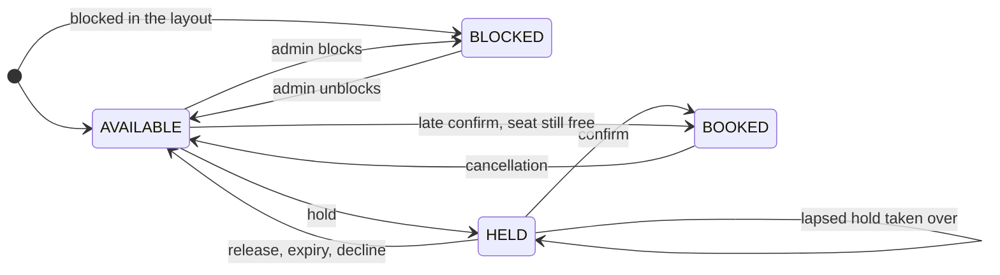

- Each change is UPDATE ... WHERE status = expected, so two requests can't both win.
- A lapsed hold is treated as AVAILABLE by every read and claim, even before the sweeper tidies it.

## Core flows

### Holding seats

Many customers, one seat: exactly one wins, and nobody waits on a lock.

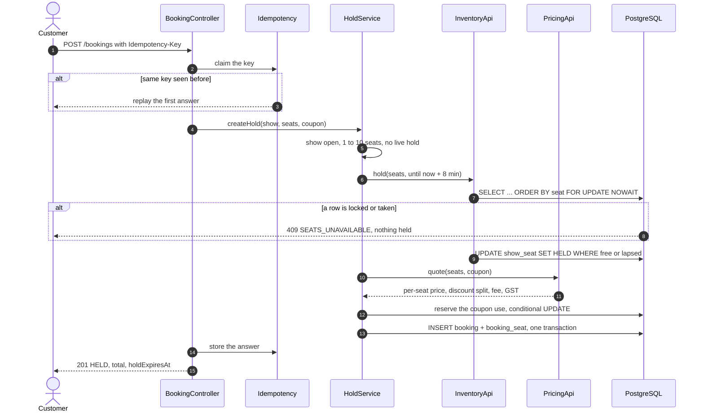

- NOWAIT means a customer racing for a seat gets an answer at once instead of queueing behind a lock.
- Rows are locked in seat order, so two overlapping multi-seat holds can never deadlock.
- Proven by a test: 500 threads for one seat, exactly one 201, repeated many times.
- The hold, the price and the coupon use are one transaction: all of it happens or none of it.

### Paying: confirm, decline, delay and the late path

Three short transactions around the gateway call, so no lock is held while the bank thinks.

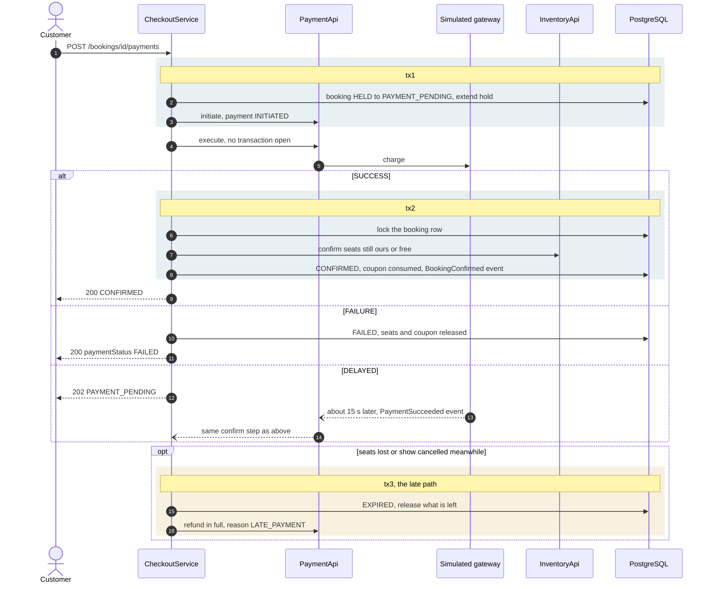

- The gateway call runs outside any transaction: a slow bank never holds a database lock.
- The delayed answer comes back as an event and takes exactly the same confirm step.
- If the seats went to someone else, the confirm fails cleanly and a full refund is issued: nobody pays for a seat they don't get.
- payment_one_success and the idempotency key make a double-tapped Pay harmless.

### Cancelling and getting a refund

The preview and the real cancellation run the same calculation, so they agree to the paisa.

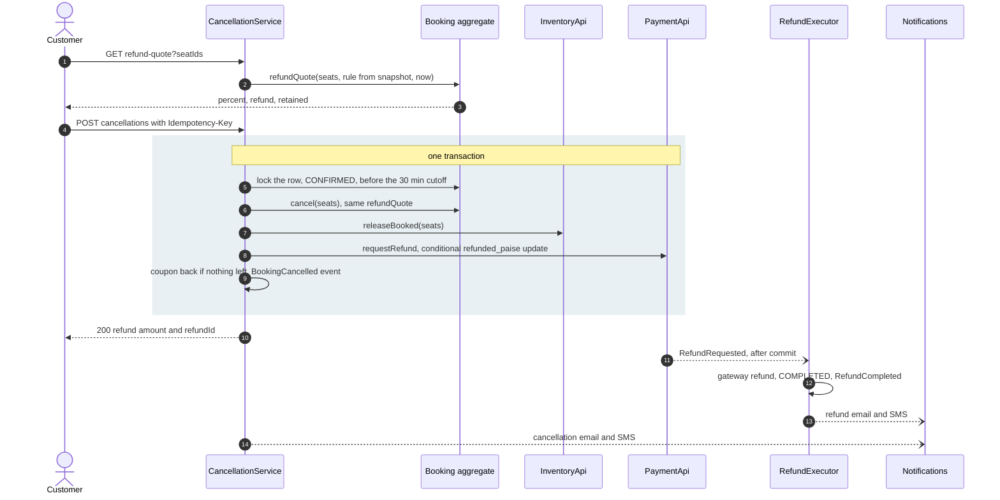

- The refund rule comes from the booking's own snapshot of its policy: slab by whole hours, fees only if the policy says so.
- The row lock makes two simultaneous cancels queue: one succeeds, the other gets a clean 409.
- The refund moves after commit through the outbox; a crash in between just redelivers it, and a refund that's no longer INITIATED is skipped.

### An admin cancels a show

Every hold released, every booking refunded in full, and no race with a payment in flight.

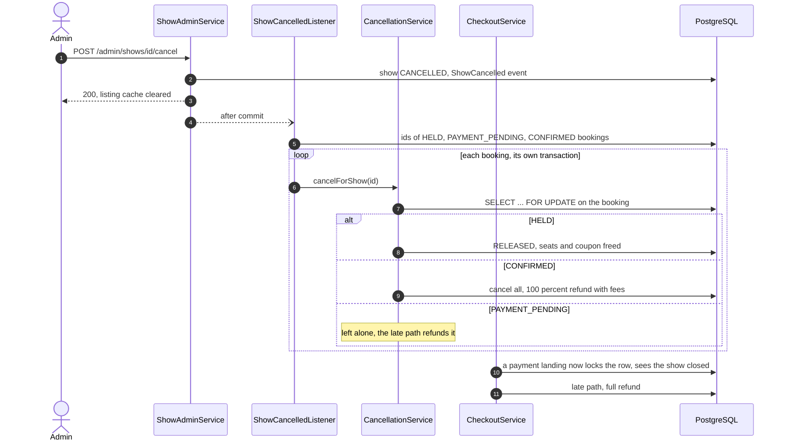

- Confirm locks the booking before checking the show; the listener locks it too, so whichever runs second sees the other.
- One failing booking doesn't stop the rest; the listener rethrows at the end and the outbox retries it.
- Re-running is harmless: handled bookings are already terminal and are skipped.

### Events and notifications, exactly once

Stored with the change, delivered after commit, retried until done, sent once.

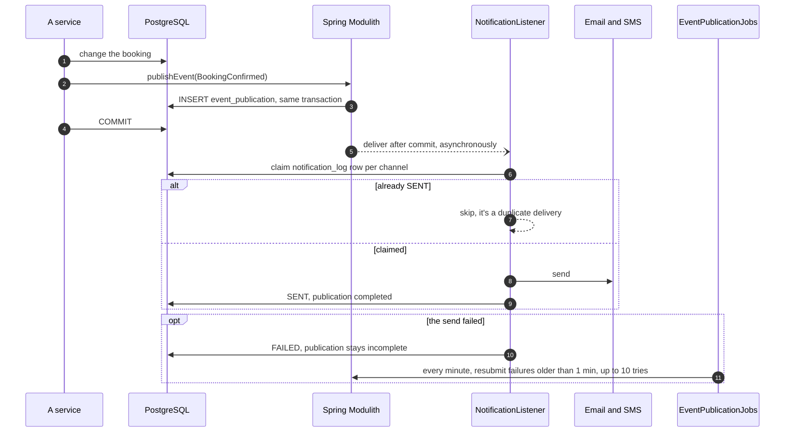

- The event can't be lost: it's committed together with the change that caused it.
- Delivery is at least once; the notification_log claim makes the effect exactly once per channel.
- Each channel commits on its own, so an email that went out isn't re-sent when the SMS fails and is retried.

### Background jobs

Scheduled work that runs on exactly one instance per round.

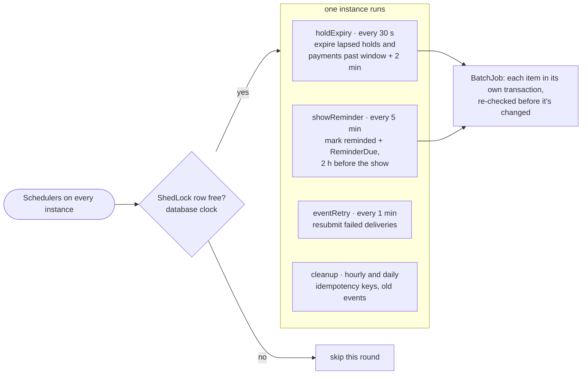

- The sweeper isn't needed for correctness: reads already treat a lapsed hold as free. It makes it official and frees coupons.
- Each item is re-checked inside its transaction: a customer who started paying after the batch was picked keeps their seats.
- Reminders are marked and published in one transaction, so a reminder is never lost and never sent twice.

### How a price is built

A pipeline of rules; the worked example is two Regular seats on a Sunday with a ₹50 coupon.

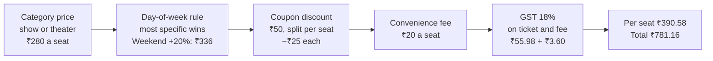

- Amounts are always whole paise in a long; no floating point anywhere near money.
- The discount is split across seats by largest remainder, so the seats add up to the total exactly.
- Adding a rule is a new PricingRule class with an @Order; the calculator doesn't change.
