# Movie Ticket Booking System: Low-Level Design

**Version:** 1.0 · **Last updated:** 23 Sep 2026 · **Companion docs:** [Project Decisions](PROJECT_DECISIONS.md), [Implementation Plan](IMPLEMENTATION_PLAN.md)

This is the implementable design for v1: modules, classes, schema, state machines, SQL on the contended paths, the flows end to end, the API, errors, transactions, caching, jobs and events. The *why* behind each choice is in the decisions doc (decisions are cited as D-xx).

---

## Contents

1. [Conventions](#1-conventions)
2. [Architecture](#2-architecture)
3. [Package structure](#3-package-structure)
4. [Database schema](#4-database-schema)
5. [State machines](#5-state-machines)
6. [Module design (class level)](#6-module-design-class-level)
7. [SQL on the contended paths](#7-sql-on-the-contended-paths)
8. [Core flows](#8-core-flows)
9. [Concurrency: every race and how it resolves](#9-concurrency-every-race-and-how-it-resolves)
10. [REST API](#10-rest-api)
11. [Errors](#11-errors)
12. [Transactions](#12-transactions)
13. [Caching (Redis)](#13-caching-redis)
14. [Scheduled jobs](#14-scheduled-jobs)
15. [Events](#15-events)
16. [Configuration](#16-configuration)
17. [Runtime view](#17-runtime-view)

---

## 1. Conventions

| Topic | Rule |
|---|---|
| IDs | `BIGINT` identity for catalog, show, seat, pricing and coupon rows. `UUID`, generated in the application, for booking, cancellation, payment and refund, because customers see these (D-21). |
| Money | Stored as `BIGINT` paise in `*_paise` columns; `Money` record in code. Rounding is `HALF_UP`, per seat line. |
| Time | `timestamptz` stored in UTC, `Instant` in code. `show_date` is a `DATE`. Times are converted to the city's `ZoneId` only for display and slot filtering. |
| Clock | Every time-dependent class takes an injected `java.time.Clock`. SQL receives `:now` from that clock, never Postgres's `now()`, so tests can move time forward. |
| Enums | Stored as `VARCHAR` with a `CHECK` constraint rather than Postgres enum types, which are easier to change in migrations. `@Enumerated(STRING)` in JPA. |
| Optimistic locking | `version BIGINT` + `@Version` on the aggregates that change concurrently: `show`, `booking`, `coupon`, `payment`. |
| Audit | Admin tables carry `created_at, created_by, updated_at, updated_by`, filled by Spring Data auditing through an `AuditorAware` that reads `CurrentUser`. |
| Soft delete | `active = false` on city, theater, screen and movie. Shows use `status = CANCELLED`. Nothing that bookings reference is ever deleted. |
| Cross-module references | Code refers to other modules **by ID only**: no JPA relationships across modules, no SQL joins across module tables. Foreign keys in the database across modules are allowed, because they protect integrity without coupling the code. |
| Naming | Tables are snake_case and singular. REST paths are plural, under `/api/v1`. Admin paths are under `/api/v1/admin`. |
| Web layer | Each module's controllers live in `internal/web/` with their DTOs beside them, one file each, package-private, named `XxxRequest` / `XxxResponse` (a record used for both input and output is split in two). No DTO is nested inside a controller, and none leaves the `web` package: services take and return domain types. |

---

## 2. Architecture

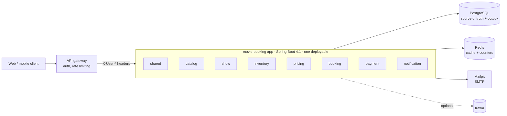

### 2.1 Module responsibilities

| Module | Owns tables | Public API (root package) | Publishes | Listens to |
|---|---|---|---|---|
| **shared** (open) | `app_user`, `idempotency_record`, `event_publication`, `shedlock` | `Money`, `TimeWindow`, `CurrentUser`, `DomainException`, `@Idempotent`, `BatchJob` | – | – |
| **catalog** | `city`, `theater`, `screen`, `seat_category`, `seat_layout`, `layout_seat`, `movie` | `CatalogApi` | – | – |
| **show** | `show` | `ShowApi`, `ShowDetails` | `ShowCancelled` | – |
| **inventory** | `show_seat` | `InventoryApi`, `SeatAvailabilityReader` | – | – |
| **pricing** | `theater_category_price`, `show_category_price`, `pricing_rule`, `coupon`, `coupon_scope`, `coupon_user_usage`, `coupon_redemption` | `PricingApi`, `CouponApi` | – | – |
| **booking** | `booking`, `booking_seat`, `cancellation`, `refund_policy`, `refund_policy_slab` | events only | `BookingConfirmed`, `BookingCancelled`, `ReminderDue` | `ShowCancelled`, `PaymentSucceeded`, `PaymentFailed` |
| **payment** | `payment`, `refund` | `PaymentApi` | `PaymentSucceeded`, `PaymentFailed`, `RefundCompleted` (+ internal `RefundRequested`) | its own `RefundRequested` |
| **notification** | `notification_log` | – | – | `BookingConfirmed`, `BookingCancelled`, `ReminderDue`, `RefundCompleted` |

### 2.2 Module dependencies

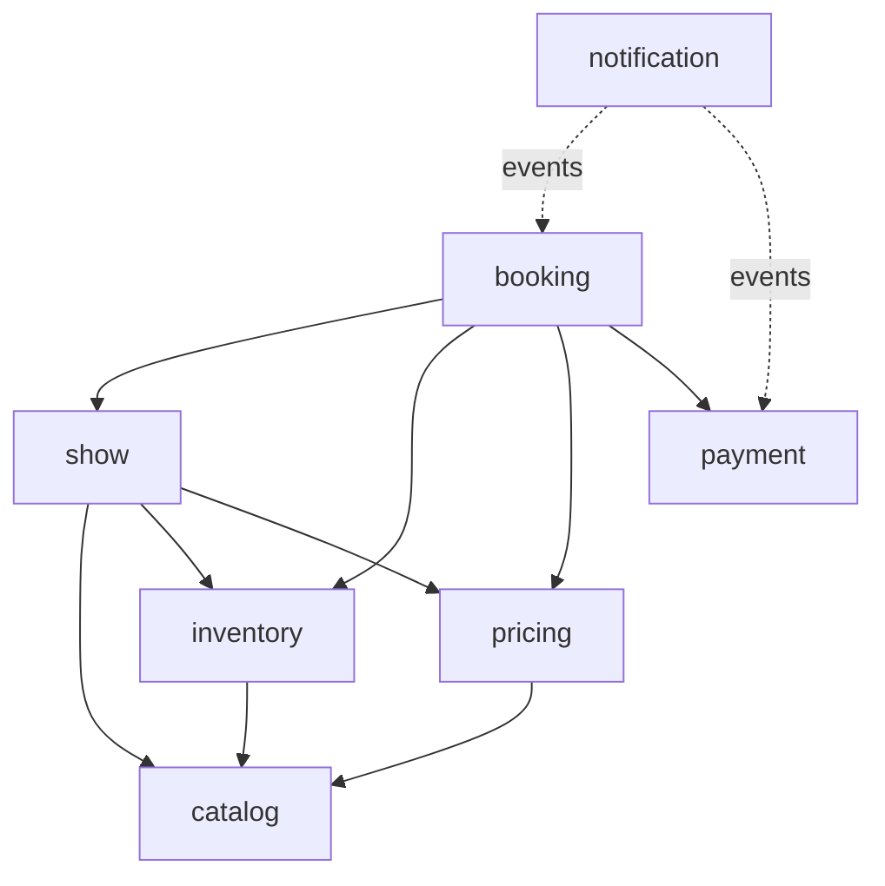

Every module may use `shared`. There are no cycles. Each module's `package-info.java` locks this graph down with `@ApplicationModule(allowedDependencies = …)`, so a new dependency (even one that forms no cycle, like payment → catalog) fails `ModularityTest` until it's added there on purpose. `ModularityTest` runs `ApplicationModules.of(MovieBookingApplication.class).verify()` and fails the build on a cycle or on a reference into another module's `internal` package.

How the modules stay independent:

- **Pricing never calls show.** Booking gathers the show context (city, theater, movie, date, seat categories) and passes it to pricing in the request.
- **Search never joins catalog tables.** The show module reads its own `show` table, then fills in theater and movie details with batched, cached `CatalogApi` calls.
- **Inventory never joins catalog tables.** `show_seat` keeps its own copy of `seat_label` and `category_id`, taken from the layout version when the show is created. That layout version never changes.
- **Events carry everything listeners need**, so notification never calls back into booking.

### 2.3 Request path

```
Gateway → Controller (HTTP ↔ DTO only)
        → Application service (transaction boundary, orchestration)
        → Domain (aggregates, state enums, strategies)
        → Repository (JPA) / JdbcClient (contended SQL, search)
        → Other modules only through their *Api interfaces
```

---

## 3. Package structure

Single Maven project, base package `com.sumit.movieticketbookingsystem`. Each module's root package is its public API; `internal/` is hidden from other modules.

```
com.sumit.movieticketbookingsystem
├── MovieBookingApplication
├── shared/                         @ApplicationModule(type = OPEN)
│   ├── Money, TimeWindow, SeatRef, Allocator, ClockConfig, BookingProperties
│   ├── persistence/  AuditedEntity, JpaAuditingConfig
│   ├── user/         CurrentUser, Role, CurrentUserInterceptor, AdminOnlyInterceptor, CurrentUserArgumentResolver,
│   │                 CurrentUserWebConfig, UserSyncInterceptor, UserDirectory, Recipient
│   ├── (web config lives in user/)
│   ├── error/        ErrorCode, DomainException, IllegalTransitionException, NotFoundException,
│   │                 ValidationException, GlobalExceptionHandler
│   ├── idempotency/  Idempotent, IdempotencyAspect, IdempotencyStore, IdempotencyCleanupJob
│   └── job/          BatchJob, SchedulingConfig, EventRetryJob, EventCleanupJob
├── catalog/
│   ├── CatalogApi, CitySummary, TheaterSummary, ScreenInfo, LayoutView, LayoutSeatInfo, MovieInfo
│   └── internal/
│       ├── web/          CityController, CityAdminController, TheaterAdminController,
│       │                 ScreenAdminController, LayoutAdminController, MovieAdminController
│       ├── domain/       City, Theater, Screen, SeatCategory, SeatLayout, LayoutSeat,
│       │                 LayoutStatus, SeatType, SeatLayoutBuilder, Movie, Certification
│       ├── service/      CatalogFacade, CityService, TheaterAdminService,
│       │                 LayoutAdminService, MovieService
│       └── persistence/  *Repository
├── show/
│   ├── ShowApi, ShowDetails, ShowStatus, ShowCancelled
│   └── internal/
│       ├── web/          ShowAdminController, BrowseController, SeatMapController
│       ├── domain/       Show, TimeSlot
│       ├── service/      ShowFacade, ShowAdminService, BrowseService, ShowDateResolver, SlotResolver,
│       │                 SeatMapService
│       ├── query/        ShowQueryService, DbShowQueryService, CachingShowQueryService,
│       │                 ShowSearchRepository, ShowCacheEvictor
│       └── persistence/  ShowRepository
├── inventory/
│   ├── InventoryApi, SeatAvailabilityReader, HeldSeat, SeatStatusView, SeatsUnavailableException
│   └── internal/         InventoryFacade, SeatInventoryRepository, SeatCounter
├── pricing/
│   ├── PricingApi, CouponApi, PricingRequest, PriceQuote, SeatPriceLine, CouponContext,
│   │   CouponInvalidException
│   └── internal/
│       ├── rule/         PricingRule, PricingContext, PriceCalculator, BaseTierPriceRule,
│       │                 DayOfWeekRule, DiscountRule, ConvenienceFeeRule, GstRule
│       ├── coupon/       CouponService, CouponRule (+5 rules), DiscountCalculator, FlatDiscount,
│       │                 PercentageDiscount, DiscountCalculatorRegistry, Coupon, CouponRedemptionRepository
│       ├── web/          TheaterPriceAdminController, PricingRuleAdminController, CouponAdminController
│       ├── service/      PricingFacade, CouponFacade, ShowPriceService
│       └── persistence/
├── booking/
│   ├── BookingConfirmed, BookingCancelled, ReminderDue, CancellationReason
│   └── internal/
│       ├── web/          BookingController, RefundPolicyAdminController
│       ├── domain/       Booking, BookingSeat, Cancellation, BookingStatus, BookingRefGenerator, RefundRule, RefundQuote
│       ├── refund/       RefundPolicy (entity), RefundSlab, RefundPolicyType, RefundPolicySnapshot (refundRule()),
│       │                 SlabRefundRule, FullRefundRule, NoRefundRule, RefundPolicyService, RefundPolicyRepository
│       ├── service/      HoldService, CheckoutService, CancellationService, BookingQueryService
│       ├── listener/     ShowCancelledListener, PaymentEventsListener
│       ├── job/          HoldExpiryJob, ReminderJob
│       └── persistence/  BookingRepository, RefundPolicyRepository
├── payment/
│   ├── PaymentApi, PaymentMethod, PaymentDetails (+ CardDetails, UpiDetails, NetBankingDetails,
│   │   WalletDetails), InitiatePayment, PaymentResult, PaymentSummary, RefundRequest, RefundReason,
│   │   SimulatedOutcome, PaymentSucceeded, PaymentFailed, RefundCompleted
│   └── internal/
│       ├── processor/    PaymentProcessor, ProcessorResult, CardPaymentProcessor, UpiPaymentProcessor,
│       │                 NetBankingPaymentProcessor, WalletPaymentProcessor,
│       │                 PaymentProcessorRegistry, PaymentSimulator
│       ├── domain/       Payment, PaymentStatus, Refund, RefundStatus, RefundRequested
│       ├── service/      PaymentFacade, RefundExecutor
│       └── persistence/
└── notification/
    └── internal/
        └── NotificationListener, NotificationService, NotificationType, Channel, NotificationChannel,
            EmailChannel, SmsChannel, TemplateRenderer, RenderedMessage, NotificationLogRepository (JdbcClient)
```

---

## 4. Database schema

Flyway owns the schema (`spring.jpa.hibernate.ddl-auto=validate`). Migration files are listed in the implementation plan. The DDL below is the target v1 schema.

### 4.1 Entity relationships

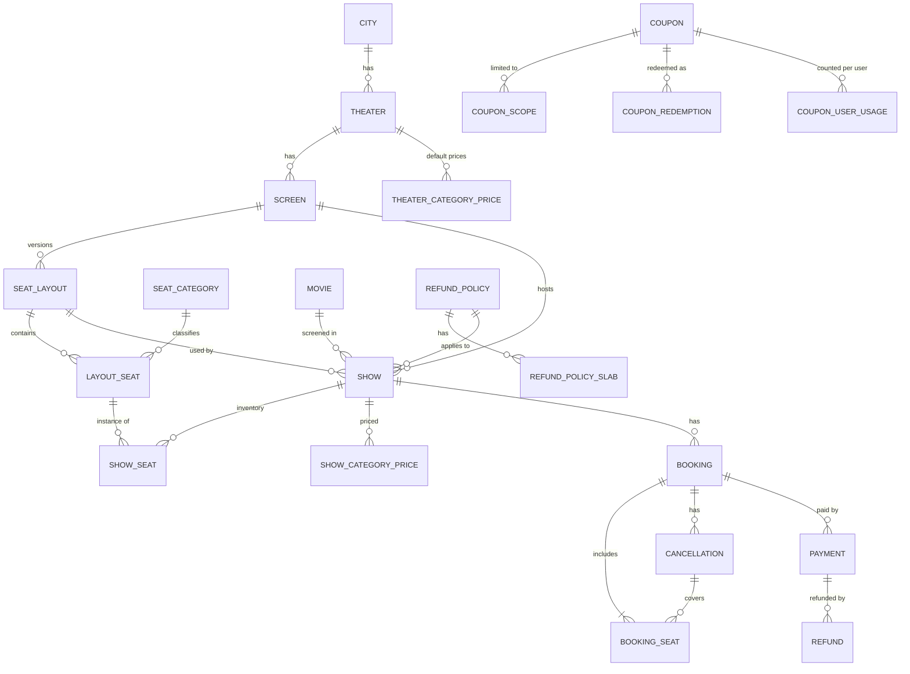

### 4.2 Shared

```sql
CREATE EXTENSION IF NOT EXISTS btree_gist;          -- needed by show_no_overlap

CREATE TABLE app_user (
    id          UUID         PRIMARY KEY,            -- from X-User-Id
    name        VARCHAR(120),
    email       VARCHAR(254),
    phone       VARCHAR(20),
    role        VARCHAR(10)  NOT NULL CHECK (role IN ('ADMIN','CUSTOMER')),
    created_at  TIMESTAMPTZ  NOT NULL DEFAULT now(),
    updated_at  TIMESTAMPTZ  NOT NULL DEFAULT now()
);

CREATE TABLE idempotency_record (
    user_id          UUID         NOT NULL,
    idem_key         VARCHAR(80)  NOT NULL,
    request_hash     CHAR(64)     NOT NULL,          -- SHA-256 of method + path + body
    status           VARCHAR(12)  NOT NULL CHECK (status IN ('IN_PROGRESS','COMPLETED')),
    response_status  INT,
    response_body    JSONB,
    created_at       TIMESTAMPTZ  NOT NULL DEFAULT now(),
    expires_at       TIMESTAMPTZ  NOT NULL,
    PRIMARY KEY (user_id, idem_key)
);

CREATE TABLE shedlock (
    name        VARCHAR(64)   PRIMARY KEY,
    lock_until  TIMESTAMP     NOT NULL,
    locked_at   TIMESTAMP     NOT NULL,
    locked_by   VARCHAR(255)  NOT NULL
);

-- event_publication: copy schema-postgresql.sql from the spring-modulith-events-jdbc jar
-- that matches your Spring Modulith version, and turn off Modulith's own schema initialization.
```

### 4.3 Catalog

```sql
CREATE TABLE city (
    id          BIGINT GENERATED BY DEFAULT AS IDENTITY PRIMARY KEY,
    name        VARCHAR(80)  NOT NULL UNIQUE,
    state       VARCHAR(80),
    timezone    VARCHAR(40)  NOT NULL DEFAULT 'Asia/Kolkata',
    active      BOOLEAN      NOT NULL DEFAULT TRUE,
    created_at  TIMESTAMPTZ  NOT NULL DEFAULT now(), created_by UUID,
    updated_at  TIMESTAMPTZ  NOT NULL DEFAULT now(), updated_by UUID
);

CREATE TABLE theater (
    id          BIGINT GENERATED BY DEFAULT AS IDENTITY PRIMARY KEY,
    city_id     BIGINT       NOT NULL REFERENCES city(id),
    name        VARCHAR(120) NOT NULL,
    area        VARCHAR(120),
    address     VARCHAR(300),
    active      BOOLEAN      NOT NULL DEFAULT TRUE,
    created_at  TIMESTAMPTZ  NOT NULL DEFAULT now(), created_by UUID,
    updated_at  TIMESTAMPTZ  NOT NULL DEFAULT now(), updated_by UUID,
    UNIQUE (city_id, name)
);

CREATE TABLE screen (
    id          BIGINT GENERATED BY DEFAULT AS IDENTITY PRIMARY KEY,
    theater_id  BIGINT       NOT NULL REFERENCES theater(id),
    name        VARCHAR(40)  NOT NULL,
    active      BOOLEAN      NOT NULL DEFAULT TRUE,
    created_at  TIMESTAMPTZ  NOT NULL DEFAULT now(), created_by UUID,
    updated_at  TIMESTAMPTZ  NOT NULL DEFAULT now(), updated_by UUID,
    UNIQUE (theater_id, name)
);

CREATE TABLE seat_category (
    id          BIGINT GENERATED BY DEFAULT AS IDENTITY PRIMARY KEY,
    code        VARCHAR(20)  NOT NULL UNIQUE,        -- REGULAR, PREMIUM, RECLINER
    name        VARCHAR(40)  NOT NULL,
    sort_order  INT          NOT NULL
);

CREATE TABLE seat_layout (
    id           BIGINT GENERATED BY DEFAULT AS IDENTITY PRIMARY KEY,
    screen_id    BIGINT       NOT NULL REFERENCES screen(id),
    version      INT          NOT NULL,
    status       VARCHAR(10)  NOT NULL CHECK (status IN ('DRAFT','ACTIVE','RETIRED')),
    grid_rows    INT          NOT NULL CHECK (grid_rows > 0),
    grid_cols    INT          NOT NULL CHECK (grid_cols > 0),
    total_seats  INT          NOT NULL CHECK (total_seats > 0),
    created_at   TIMESTAMPTZ  NOT NULL DEFAULT now(), created_by UUID,
    updated_at   TIMESTAMPTZ  NOT NULL DEFAULT now(), updated_by UUID,
    UNIQUE (screen_id, version)
);
CREATE UNIQUE INDEX seat_layout_one_active ON seat_layout (screen_id) WHERE status = 'ACTIVE';

CREATE TABLE layout_seat (
    id           BIGINT GENERATED BY DEFAULT AS IDENTITY PRIMARY KEY,
    layout_id    BIGINT       NOT NULL REFERENCES seat_layout(id),
    row_label    VARCHAR(4)   NOT NULL,
    seat_number  INT          NOT NULL,
    grid_row     INT          NOT NULL,
    grid_col     INT          NOT NULL,              -- aisles are empty grid cells
    category_id  BIGINT       NOT NULL REFERENCES seat_category(id),
    seat_type    VARCHAR(12)  NOT NULL CHECK (seat_type IN ('NORMAL','WHEELCHAIR','BLOCKED')),
    UNIQUE (layout_id, row_label, seat_number),
    UNIQUE (layout_id, grid_row, grid_col)
);

CREATE TABLE movie (
    id             BIGINT GENERATED BY DEFAULT AS IDENTITY PRIMARY KEY,
    title          VARCHAR(200) NOT NULL,
    duration_min   INT          NOT NULL CHECK (duration_min > 0),
    certification  VARCHAR(10)  NOT NULL,           -- U, UA, A …
    release_date   DATE,
    active         BOOLEAN      NOT NULL DEFAULT TRUE,
    created_at     TIMESTAMPTZ  NOT NULL DEFAULT now(), created_by UUID,
    updated_at     TIMESTAMPTZ  NOT NULL DEFAULT now(), updated_by UUID
);
```

### 4.4 Refund policies (booking module; created early because `show` references them)

```sql
CREATE TABLE refund_policy (
    id           BIGINT GENERATED BY DEFAULT AS IDENTITY PRIMARY KEY,
    name         VARCHAR(80)  NOT NULL UNIQUE,
    type         VARCHAR(16)  NOT NULL CHECK (type IN ('SLAB','FULL','NON_REFUNDABLE')),
    refund_fees  BOOLEAN      NOT NULL DEFAULT FALSE,
    is_default   BOOLEAN      NOT NULL DEFAULT FALSE,
    created_at   TIMESTAMPTZ  NOT NULL DEFAULT now(), created_by UUID,
    updated_at   TIMESTAMPTZ  NOT NULL DEFAULT now(), updated_by UUID
);
CREATE UNIQUE INDEX refund_policy_one_default ON refund_policy (is_default) WHERE is_default;
-- (no `active` flag: nothing needs to retire a policy yet. The migration seeds 'Standard' (24h 100%, 4h 50%, 0h 0%) as the default.)

CREATE TABLE refund_policy_slab (
    policy_id         BIGINT NOT NULL REFERENCES refund_policy(id),
    min_hours_before  INT    NOT NULL CHECK (min_hours_before >= 0),
    refund_percent    INT    NOT NULL CHECK (refund_percent BETWEEN 0 AND 100),
    PRIMARY KEY (policy_id, min_hours_before)
);
```

### 4.5 Show

```sql
CREATE TABLE show (
    id                BIGINT GENERATED BY DEFAULT AS IDENTITY PRIMARY KEY,
    movie_id          BIGINT       NOT NULL REFERENCES movie(id),
    screen_id         BIGINT       NOT NULL REFERENCES screen(id),
    theater_id        BIGINT       NOT NULL REFERENCES theater(id),   -- copied for search
    city_id           BIGINT       NOT NULL REFERENCES city(id),      -- copied for search
    layout_id         BIGINT       NOT NULL REFERENCES seat_layout(id),
    show_date         DATE         NOT NULL,        -- listing date (late-night rule)
    start_time        TIMESTAMPTZ  NOT NULL,
    end_time          TIMESTAMPTZ  NOT NULL,
    blocked_until     TIMESTAMPTZ  NOT NULL,        -- end_time + cleaning buffer
    language          VARCHAR(10)  NOT NULL,
    format            VARCHAR(10)  NOT NULL,        -- 2D, 3D, IMAX …
    status            VARCHAR(10)  NOT NULL CHECK (status IN ('SCHEDULED','OPEN','CANCELLED')),
    total_seats       INT          NOT NULL,        -- sellable seats, for the "filling fast" badge
    price_from_paise  BIGINT,
    refund_policy_id  BIGINT       REFERENCES refund_policy(id),   -- NULL = use the default policy (added in M7)
    version           BIGINT       NOT NULL DEFAULT 0,
    created_at        TIMESTAMPTZ  NOT NULL DEFAULT now(), created_by UUID,
    updated_at        TIMESTAMPTZ  NOT NULL DEFAULT now(), updated_by UUID,
    CHECK (end_time > start_time AND blocked_until >= end_time),
    CONSTRAINT show_no_overlap EXCLUDE USING gist (
        screen_id WITH =,
        tstzrange(start_time, blocked_until) WITH &&
    ) WHERE (status <> 'CANCELLED')
);
CREATE INDEX show_browse_idx  ON show (city_id, movie_id, show_date, start_time);
CREATE INDEX show_theater_idx ON show (theater_id, show_date);
```

### 4.6 Pricing and coupons

```sql
CREATE TABLE theater_category_price (
    theater_id   BIGINT NOT NULL REFERENCES theater(id),
    category_id  BIGINT NOT NULL REFERENCES seat_category(id),
    price_paise  BIGINT NOT NULL CHECK (price_paise > 0),
    PRIMARY KEY (theater_id, category_id)
);

CREATE TABLE show_category_price (
    show_id      BIGINT  NOT NULL REFERENCES show(id),
    category_id  BIGINT  NOT NULL REFERENCES seat_category(id),
    price_paise  BIGINT  NOT NULL CHECK (price_paise > 0),
    overridden   BOOLEAN NOT NULL DEFAULT FALSE,     -- TRUE when the admin changed it for this show
    PRIMARY KEY (show_id, category_id)
);

CREATE TABLE pricing_rule (
    id                BIGINT GENERATED BY DEFAULT AS IDENTITY PRIMARY KEY,
    name              VARCHAR(80)  NOT NULL,
    scope_type        VARCHAR(10)  NOT NULL CHECK (scope_type IN ('GLOBAL','CITY','THEATER')),
    scope_id          BIGINT,
    days_of_week      SMALLINT[]   NOT NULL,         -- ISO: 1 = Monday … 7 = Sunday
    adjustment_type   VARCHAR(10)  NOT NULL CHECK (adjustment_type IN ('PERCENT','FLAT')),
    adjustment_value  BIGINT       NOT NULL CHECK (adjustment_value > 0),   -- surcharges only; discounts are coupons
    valid_from        DATE,
    valid_to          DATE,
    active            BOOLEAN      NOT NULL DEFAULT TRUE,
    created_at        TIMESTAMPTZ  NOT NULL DEFAULT now(), created_by UUID,
    updated_at        TIMESTAMPTZ  NOT NULL DEFAULT now(), updated_by UUID,
    CHECK ((scope_type = 'GLOBAL') = (scope_id IS NULL))
);

CREATE TABLE coupon (
    id                  BIGINT GENERATED BY DEFAULT AS IDENTITY PRIMARY KEY,
    code                VARCHAR(30)  NOT NULL UNIQUE,   -- stored upper-case
    discount_type       VARCHAR(10)  NOT NULL CHECK (discount_type IN ('FLAT','PERCENT')),
    discount_value      BIGINT       NOT NULL CHECK (discount_value > 0),   -- paise or percent
    max_discount_paise  BIGINT,
    min_order_paise     BIGINT       NOT NULL DEFAULT 0,
    valid_from          TIMESTAMPTZ  NOT NULL,
    valid_to            TIMESTAMPTZ  NOT NULL,
    max_uses            INT,                            -- NULL = unlimited
    used_count          INT          NOT NULL DEFAULT 0, -- RESERVED + CONSUMED; read-only in JPA, only redemption SQL writes it
    per_user_limit      INT          NOT NULL DEFAULT 1 CHECK (per_user_limit > 0),
    active              BOOLEAN      NOT NULL DEFAULT TRUE,
    created_at          TIMESTAMPTZ  NOT NULL DEFAULT now(), created_by UUID,
    updated_at          TIMESTAMPTZ  NOT NULL DEFAULT now(), updated_by UUID,
    CHECK (valid_to > valid_from),
    CHECK (discount_type = 'FLAT' OR discount_value <= 100),
    CHECK (used_count >= 0 AND (max_uses IS NULL OR used_count <= max_uses))
);

CREATE TABLE coupon_scope (
    coupon_id   BIGINT       NOT NULL REFERENCES coupon(id),
    scope_type  VARCHAR(10)  NOT NULL CHECK (scope_type IN ('CITY','THEATER','MOVIE','CATEGORY')),
    scope_id    BIGINT       NOT NULL,
    PRIMARY KEY (coupon_id, scope_type, scope_id)
);
-- No rows = the coupon applies everywhere. Rows of the same type are OR-ed; different types are AND-ed.

CREATE TABLE coupon_user_usage (
    coupon_id   BIGINT NOT NULL REFERENCES coupon(id),
    user_id     UUID   NOT NULL,
    used_count  INT    NOT NULL CHECK (used_count >= 0),
    PRIMARY KEY (coupon_id, user_id)
);

CREATE TABLE coupon_redemption (
    id              BIGINT GENERATED BY DEFAULT AS IDENTITY PRIMARY KEY,
    coupon_id       BIGINT       NOT NULL REFERENCES coupon(id),
    user_id         UUID         NOT NULL,
    booking_id      UUID         NOT NULL,
    discount_paise  BIGINT       NOT NULL,
    status          VARCHAR(10)  NOT NULL CHECK (status IN ('RESERVED','CONSUMED','RELEASED')),
    created_at      TIMESTAMPTZ  NOT NULL DEFAULT now(),
    updated_at      TIMESTAMPTZ  NOT NULL DEFAULT now()
);
CREATE UNIQUE INDEX coupon_redemption_one_live ON coupon_redemption (booking_id) WHERE status <> 'RELEASED';
-- no FK to booking: the coupon is reserved before the booking row is inserted, in the same transaction
```

### 4.7 Inventory

```sql
CREATE TABLE show_seat (
    show_id          BIGINT       NOT NULL REFERENCES show(id),
    layout_seat_id   BIGINT       NOT NULL REFERENCES layout_seat(id),
    seat_label       VARCHAR(8)   NOT NULL,          -- copied from the layout version at show creation
    category_id      BIGINT       NOT NULL,          -- copied from the layout version at show creation
    status           VARCHAR(10)  NOT NULL CHECK (status IN ('AVAILABLE','HELD','BOOKED','BLOCKED')),
    booking_id       UUID,                            -- the single owner
    hold_expires_at  TIMESTAMPTZ,
    version          BIGINT       NOT NULL DEFAULT 0,
    PRIMARY KEY (show_id, layout_seat_id),
    CHECK (
         (status IN ('AVAILABLE','BLOCKED') AND booking_id IS NULL     AND hold_expires_at IS NULL)
      OR (status = 'HELD'                   AND booking_id IS NOT NULL AND hold_expires_at IS NOT NULL)
      OR (status = 'BOOKED'                 AND booking_id IS NOT NULL AND hold_expires_at IS NULL)
    )
);
CREATE INDEX show_seat_booking_idx ON show_seat (booking_id) WHERE booking_id IS NOT NULL;
```

**Why double allocation is impossible (D-05).** There is exactly one row per seat per show (the primary key), and each row has exactly one `booking_id` owner. Every write that sets an owner is a conditional update, checked by the number of rows it changed (§7). Two bookings can't both own the same row.

### 4.8 Booking

```sql
CREATE TABLE booking (
    id                      UUID         PRIMARY KEY,
    booking_ref             VARCHAR(12)  NOT NULL UNIQUE,   -- e.g. BK7X9Q2M
    user_id                 UUID         NOT NULL,
    show_id                 BIGINT       NOT NULL REFERENCES show(id),
    show_start_time         TIMESTAMPTZ  NOT NULL,          -- copied for reminders and refunds
    status                  VARCHAR(16)  NOT NULL CHECK (status IN
                              ('HELD','PAYMENT_PENDING','CONFIRMED','CANCELLED','RELEASED','EXPIRED','FAILED')),
    hold_expires_at         TIMESTAMPTZ  NOT NULL,
    seat_count              INT          NOT NULL CHECK (seat_count > 0),
    subtotal_paise          BIGINT       NOT NULL,          -- tier prices + day-of-week adjustments
    discount_paise          BIGINT       NOT NULL DEFAULT 0,
    fee_paise               BIGINT       NOT NULL,
    tax_paise               BIGINT       NOT NULL,
    total_paise             BIGINT       NOT NULL,
    coupon_code             VARCHAR(30),
    -- (no price_breakdown JSON: booking_seat amounts + the totals above are the frozen quote)
    refund_policy_snapshot  JSONB,                          -- set at confirmation
    reminder_sent_at        TIMESTAMPTZ,
    version                 BIGINT       NOT NULL DEFAULT 0,
    created_at              TIMESTAMPTZ  NOT NULL DEFAULT now(),
    confirmed_at            TIMESTAMPTZ,
    closed_at               TIMESTAMPTZ,                    -- reached a terminal state
    CHECK (total_paise = subtotal_paise - discount_paise + fee_paise + tax_paise)
);
CREATE UNIQUE INDEX booking_one_active_hold ON booking (user_id, show_id)
    WHERE status IN ('HELD','PAYMENT_PENDING');
CREATE INDEX booking_user_idx     ON booking (user_id, show_start_time DESC);
CREATE INDEX booking_show_idx     ON booking (show_id, status);
CREATE INDEX booking_expiry_idx   ON booking (hold_expires_at) WHERE status IN ('HELD','PAYMENT_PENDING');
CREATE INDEX booking_reminder_idx ON booking (show_start_time) WHERE status = 'CONFIRMED' AND reminder_sent_at IS NULL;

CREATE TABLE cancellation (
    id              UUID         PRIMARY KEY,
    booking_id      UUID         NOT NULL REFERENCES booking(id),
    reason          VARCHAR(16)  NOT NULL CHECK (reason IN ('CUSTOMER','SHOW_CANCELLED')),
    seat_count      INT          NOT NULL CHECK (seat_count > 0),
    refund_percent  INT          NOT NULL CHECK (refund_percent BETWEEN 0 AND 100),
    refund_paise    BIGINT       NOT NULL CHECK (refund_paise >= 0),
    created_at      TIMESTAMPTZ  NOT NULL DEFAULT now()
);

CREATE TABLE booking_seat (
    booking_id       UUID         NOT NULL REFERENCES booking(id),
    layout_seat_id   BIGINT       NOT NULL,
    seat_label       VARCHAR(8)   NOT NULL,
    category_id      BIGINT       NOT NULL,
    base_paise       BIGINT       NOT NULL,   -- tier price + day-of-week adjustment
    discount_paise   BIGINT       NOT NULL DEFAULT 0,   -- this seat's share of the discount
    fee_paise        BIGINT       NOT NULL,   -- convenience fee + GST on the fee
    amount_paise     BIGINT       NOT NULL,   -- this seat's share of total_paise
    status           VARCHAR(10)  NOT NULL CHECK (status IN ('ACTIVE','CANCELLED')),
    cancellation_id  UUID         REFERENCES cancellation(id),
    PRIMARY KEY (booking_id, layout_seat_id),
    CHECK (amount_paise >= fee_paise),
    CHECK ((status = 'CANCELLED') = (cancellation_id IS NOT NULL))
);

-- show_seat.booking_id → booking.id. DEFERRABLE, because the hold claims seats before inserting the booking row.
ALTER TABLE show_seat ADD CONSTRAINT show_seat_booking_fk
    FOREIGN KEY (booking_id) REFERENCES booking(id) DEFERRABLE INITIALLY DEFERRED;
```

**Snapshot stored as JSON** (the price is frozen in `booking_seat` + the booking totals instead):

```jsonc
// booking.refund_policy_snapshot
{ "policyId": 1, "name": "Standard", "type": "SLAB", "refundFees": false,
  "slabs": [ { "minHoursBefore": 24, "percent": 100 },
             { "minHoursBefore": 4,  "percent": 50 },
             { "minHoursBefore": 0,  "percent": 0 } ] }
```

### 4.9 Payment

```sql
CREATE TABLE payment (
    id               UUID         PRIMARY KEY,
    booking_id       UUID         NOT NULL REFERENCES booking(id),
    customer_id      UUID         NOT NULL,          -- like a gateway's "notes": used for notifications
    reference        VARCHAR(12)  NOT NULL,          -- booking_ref
    method           VARCHAR(12)  NOT NULL CHECK (method IN ('CARD','UPI','NET_BANKING','WALLET')),
    amount_paise     BIGINT       NOT NULL CHECK (amount_paise > 0),
    refunded_paise   BIGINT       NOT NULL DEFAULT 0,          -- added with refunds (M6 step 3)
    status           VARCHAR(10)  NOT NULL CHECK (status IN ('INITIATED','SUCCESS','FAILED')),
    provider_txn_id  VARCHAR(64),
    masked_details   VARCHAR(64),                    -- '•••• 4242', 'user@okbank', 'HDFC'
    failure_reason   VARCHAR(200),
    version          BIGINT       NOT NULL DEFAULT 0,
    created_at       TIMESTAMPTZ  NOT NULL DEFAULT now(),
    completed_at     TIMESTAMPTZ,
    CHECK (refunded_paise BETWEEN 0 AND amount_paise)
);
CREATE UNIQUE INDEX payment_one_success ON payment (booking_id) WHERE status = 'SUCCESS';
CREATE INDEX payment_booking_idx ON payment (booking_id);

CREATE TABLE refund (
    id                  UUID         PRIMARY KEY,
    payment_id          UUID         NOT NULL REFERENCES payment(id),
    booking_id          UUID         NOT NULL,
    cancellation_id     UUID         UNIQUE,         -- NULL for LATE_PAYMENT
    amount_paise        BIGINT       NOT NULL CHECK (amount_paise > 0),
    reason              VARCHAR(16)  NOT NULL CHECK (reason IN ('CUSTOMER','SHOW_CANCELLED','LATE_PAYMENT')),
    status              VARCHAR(10)  NOT NULL CHECK (status IN ('INITIATED','COMPLETED','FAILED')),
    provider_refund_id  VARCHAR(64),
    created_at          TIMESTAMPTZ  NOT NULL DEFAULT now(),
    completed_at        TIMESTAMPTZ
);
CREATE UNIQUE INDEX refund_one_late_payment ON refund (payment_id) WHERE reason = 'LATE_PAYMENT';
```

A 0% cancellation creates a `cancellation` row but no `refund` row, because `refund.amount_paise > 0`.

### 4.10 Notification

```sql
CREATE TABLE notification_log (
    id            BIGINT GENERATED BY DEFAULT AS IDENTITY PRIMARY KEY,
    booking_id    UUID         NOT NULL,
    type          VARCHAR(20)  NOT NULL CHECK (type IN
                    ('BOOKING_CONFIRMED','BOOKING_CANCELLED','REFUND_COMPLETED','SHOW_REMINDER')),
    reference_id  VARCHAR(64)  NOT NULL DEFAULT '',  -- cancellation or refund id; '' when a type happens once
    channel       VARCHAR(8)   NOT NULL CHECK (channel IN ('EMAIL','SMS')),
    status        VARCHAR(8)   NOT NULL CHECK (status IN ('PENDING','SENT','FAILED')),
    attempts      INT          NOT NULL DEFAULT 0,
    last_error    VARCHAR(300),
    created_at    TIMESTAMPTZ  NOT NULL DEFAULT now(),
    sent_at       TIMESTAMPTZ
);
CREATE UNIQUE INDEX notification_dedupe ON notification_log (booking_id, type, reference_id, channel);
```

`reference_id` is part of the de-duplication key because one booking can have several cancellations and refunds.

### 4.11 Constraint summary

| Rule | Enforced by |
|---|---|
| No seat allocated twice | `show_seat` PK + single `booking_id` owner + conditional updates |
| Seat row is always internally consistent | `show_seat` CHECK on status / owner / expiry |
| No overlapping shows on a screen | `show_no_overlap` exclusion constraint (`btree_gist`) |
| One active layout per screen | `seat_layout_one_active` |
| One default refund policy | `refund_policy_one_default` |
| One active hold per user per show | `booking_one_active_hold` |
| Totals always add up | `booking` CHECK on total |
| A booking is never charged twice | `payment_one_success` |
| Never refund more than was paid | `payment` CHECK `refunded_paise ≤ amount_paise` |
| One refund per cancellation; one late-payment refund per payment | `refund.cancellation_id UNIQUE`, `refund_one_late_payment` |
| Coupon global limit never exceeded | conditional UPDATE + `coupon` CHECK |
| One live coupon redemption per booking | `coupon_redemption_one_live` |
| No duplicate notifications | `notification_dedupe` |
| Retried requests are safe | `idempotency_record` PK |

---

## 5. State machines

Every lifecycle is an enum that lists its allowed next states. `transitionTo()` throws `IllegalTransitionException` (shared) for anything else (D-20).

### 5.1 Booking

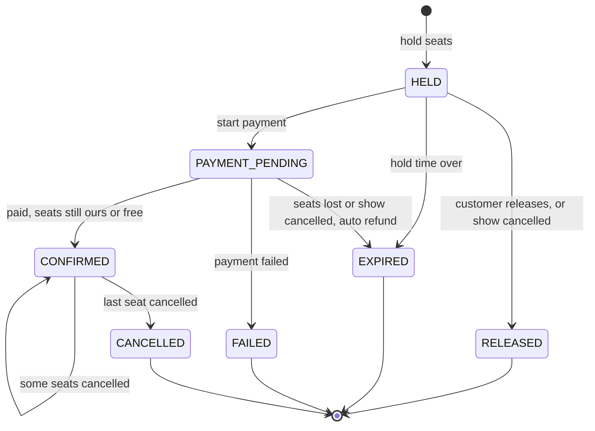

```java
public enum BookingStatus {
    HELD            { Set<BookingStatus> next() { return EnumSet.of(PAYMENT_PENDING, RELEASED, EXPIRED); } },
    PAYMENT_PENDING { Set<BookingStatus> next() { return EnumSet.of(CONFIRMED, FAILED, EXPIRED); } },
    CONFIRMED       { Set<BookingStatus> next() { return EnumSet.of(CANCELLED); } },
    CANCELLED, RELEASED, EXPIRED, FAILED;

    Set<BookingStatus> next() { return EnumSet.noneOf(BookingStatus.class); }

    public boolean isTerminal() { return next().isEmpty(); }
    public boolean holdsSeats() { return this == HELD || this == PAYMENT_PENDING; }

    public BookingStatus transitionTo(BookingStatus target) {
        if (!next().contains(target)) throw new IllegalTransitionException("Booking", this, target);
        return target;
    }
}
```

Cancelling some of a booking's seats keeps it `CONFIRMED`; the cancellation is recorded on the seats and in `cancellation`. Refund progress is tracked on `refund`, not on the booking (D-11).

### 5.2 Show seat

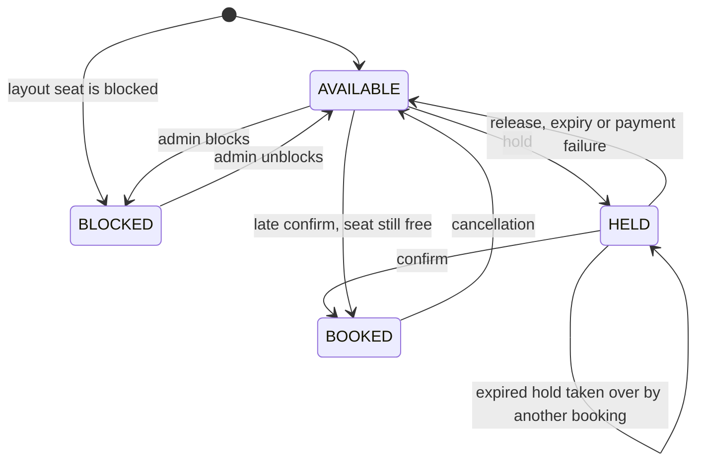

A `HELD` row whose `hold_expires_at` has passed is **treated as AVAILABLE** by every read and every claim (lazy expiry, D-06).

### 5.3 Show, payment, refund, coupon redemption, seat layout

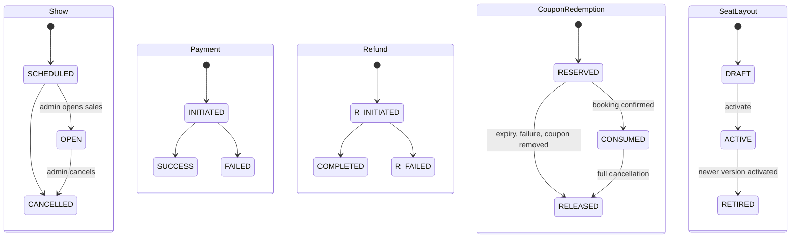

(`R_INITIATED` / `R_FAILED` are only there so the diagram doesn't merge them with Payment's states; in code they are `RefundStatus.INITIATED` / `FAILED`.)

- **Show:** "Closed for booking" isn't a state. It's worked out as `now ≥ start_time − booking cutoff` (D-19).
- **Payment:** refunds are tracked in `refunded_paise`.
- **Seat layout:** activating a new version retires the old one; shows already created keep their `layout_id`.

---

## 6. Module design (class level)

### 6.1 shared

| Class | Responsibility |
|---|---|
| `Money` (record) | Non-negative paise with overflow-safe `plus`/`minus`, `percent(p)` (HALF_UP) and `min` |
| `TimeWindow` (record) | `[from, to)` of `Instant`s; checks `from < to` |
| `SeatRef` (record) | `(rowLabel, seatNumber)` and its `F7` label format |
| `Allocator` | `largestRemainder(total, weights)` → `long[]`: splits an amount (such as a discount) across seats so the parts add up exactly |
| `ClockConfig` | `@Bean Clock clock()` returns `Clock.systemUTC()`; tests replace it with a mutable clock |
| `CurrentUser` (record) | `id, role, name, email, phone`, built from the gateway headers |
| `CurrentUserInterceptor` + `CurrentUserArgumentResolver` | The interceptor builds `CurrentUser` from the headers on `/api/v1/**` (missing or invalid `X-User-Id` / `X-User-Role` → 401); controllers get it by declaring a `CurrentUser` parameter |
| `UserSyncInterceptor` + `UserDirectory` | Upserts `app_user` from the headers, but only when this instance hasn't seen the user yet or their details changed (in-memory map of the last synced `CurrentUser`); `UserDirectory.recipient(userId)` gives notification the contact details |
| `ErrorCode` (enum) | Every error code with its HTTP status (§11) |
| `DomainException` (abstract) + subclasses | Carries an `ErrorCode` and extra details. `IllegalTransitionException`, `NotFoundException`, `ValidationException` … |
| `GlobalExceptionHandler` | Turns exceptions, including database constraint violations, into `ProblemDetail` responses (§11) |
| `@Idempotent` + `IdempotencyAspect` + `IdempotencyStore` | Makes retried requests safe (§7.11) |
| `BatchJob<T>` (abstract) | Template Method: `fetchBatch()` → `process(item)` in its own transaction → `onSkipped` / `onFailure` |

```java
public abstract class BatchJob<T> {
    private final TransactionTemplate tx;

    protected BatchJob(TransactionTemplate tx) { this.tx = tx; }

    public final int runOnce() {
        int processed = 0;
        for (T item : fetchBatch()) {
            try {
                tx.executeWithoutResult(status -> process(item));
                processed++;
            } catch (OptimisticLockingFailureException | IllegalTransitionException e) {
                onSkipped(item, e);          // someone else changed it first: fine
            } catch (RuntimeException e) {
                onFailure(item, e);          // log and continue with the rest of the batch
            }
        }
        return processed;
    }

    protected abstract List<T> fetchBatch();
    protected abstract void process(T item);
}
```

As built: skips are logged at debug and failures at error inside `BatchJob` (no `onSkipped`/`onFailure` hooks until a job needs them). `runOnce()` is deliberately **not final**: jobs carry `@SchedulerLock`, so they're CGLIB proxies, and a final method would run on the proxy with its fields unset.

### 6.2 catalog

| Class | Responsibility |
|---|---|
| `City`, `Theater` (aggregate root, owns `Screen`s), `Movie`, `SeatCategory` | JPA entities with `activate()`/`deactivate()`; no public setters |
| `SeatLayout` (aggregate root, owns `LayoutSeat`s) | `activate()` and `retire()`; seats can't change once ACTIVE |
| `SeatLayoutBuilder` + `LayoutPlan` | Builder that assembles a layout row by row and returns a validated `LayoutPlan` value; the grid size is derived from the rows |
| `LayoutAdminService` | Creates drafts from a request, edits drafts (clear seats, **flush**, add seats — Hibernate inserts before deleting otherwise), activates them (retiring the old ACTIVE layout **first and flushing**, because the partial unique index is checked per statement) |
| `CatalogFacade implements CatalogApi` | Read facade for other modules, cached (§13) |

```java
LayoutPlan plan = SeatLayoutBuilder.layout()
        .row("A").seats(1, 8, "REGULAR").aisle(2).seats(9, 16, "REGULAR")
        .row("B").seats(1, 8, "REGULAR").aisle(2).seats(9, 16, "REGULAR")
        .row("J").aisle(2).seats(1, 8, "RECLINER")
        .block(SeatRef.parse("A5"))
        .wheelchair(SeatRef.parse("J7")).wheelchair(SeatRef.parse("J8"))
        .build();   // checks: unique rows and labels, no empty rows, blocked/wheelchair seats exist, something to sell
// Seats are placed left to right with a column cursor, so grid cells can't overlap and the grid size is derived.
// SeatLayout.draft(screenId, version, plan) turns the plan into the entity; category codes are resolved there.
```

```java
public interface CatalogApi {
    ScreenInfo screen(long screenId);                          // theaterId, cityId, active (screen+theater+city), activeLayoutId
    LayoutView layout(long layoutId);                          // M3: id, screenId, totalSeats; grid + seats added with inventory
    CitySummary city(long cityId);                             // includes ZoneId
    MovieInfo movie(long movieId);
    Map<Long, MovieInfo> movies(Collection<Long> movieIds);
    Map<Long, TheaterSummary> theaters(Collection<Long> theaterIds);
}
```

### 6.3 show

| Class | Responsibility |
|---|---|
| `Show` (aggregate) + `ShowStatus` | `open()`, `cancel()`, `isBookable(now, cutoff)`. `ShowStatus` is public because `ShowDetails` exposes it |
| `ShowAdminService` | Creates, opens and cancels shows; blocks and unblocks seats; overrides prices (§8.1) |
| `ShowDateResolver` | Late-night rule: a show starting before `late-night-cutoff` (03:00) in the city's timezone is listed under the previous date, unless the admin gives `showDate` |
| `SlotResolver` + `TimeSlot` | Turns `MORNING/AFTERNOON/EVENING/NIGHT` + a date + a timezone into a `TimeWindow` |
| `ShowQueryService` (interface) | `showsForDay(cityId, movieId, date)`: unfiltered rows for one day |
| `DbShowQueryService` | Implements it with JdbcClient (§7.10) |
| `CachingShowQueryService` (`@Primary`) | **Decorator** that caches the unfiltered day in Redis |
| `BrowseService` | Filters (cutoff, slots, language, format) → groups by theater → adds theater details (`CatalogApi`) and live seat counts (`SeatAvailabilityReader`) |
| `SeatMapService` | Combines the layout (catalog) + seat statuses (inventory) + category prices (pricing) |
| `ShowCacheEvictor` | Clears the day cache after commit when a show is created, opened, cancelled or re-priced |
| `ShowFacade implements ShowApi` | Gives other modules `ShowDetails` |

Time slots for listing date `D`:

| Slot | Window (city timezone) |
|---|---|
| MORNING | `D 03:00` – `D 12:00` |
| AFTERNOON | `D 12:00` – `D 16:00` |
| EVENING | `D 16:00` – `D 20:00` |
| NIGHT | `D 20:00` – `D+1 03:00` (includes the late-night shows listed under `D`) |

```java
public interface ShowApi {
    ShowDetails show(long showId);
}

// M4 shape; M6/M7 add what confirmation and cancellation need (titles for events, cancelled flag, refund policy)
public record ShowDetails(long showId, long movieId, long theaterId, long cityId, long layoutId,
                          LocalDate showDate, Instant startTime, boolean open) {
    public boolean isBookable(Instant now, Duration cutoff) {
        return open && now.isBefore(startTime.minus(cutoff));
    }
}
```

### 6.4 inventory

| Class | Responsibility |
|---|---|
| `InventoryFacade implements InventoryApi` | Runs every seat change as a conditional update (§7.1–7.5) |
| `SeatInventoryRepository` | The JdbcClient SQL |
| `SeatCounter implements SeatAvailabilityReader` | Redis seats-left counters, adjusted **after commit**; rebuilt from the database when a key is missing |
| `SeatsUnavailableException` | `SEATS_UNAVAILABLE`, carrying the seat IDs that were lost |

```java
public interface InventoryApi {
    void initializeSeats(long showId, LayoutView layout);                             // total_seats comes from the layout
    List<HeldSeat> hold(long showId, Set<Long> seatIds, UUID bookingId,
                        Instant expiresAt, Instant now);                              // all or nothing
    void confirm(long showId, Set<Long> seatIds, UUID bookingId, Instant now);        // all or nothing
    int releaseHeld(long showId, UUID bookingId);                                     // release, expiry, failure
    void releaseBooked(long showId, Set<Long> seatIds, UUID bookingId);               // cancellation
    Set<Long> block(long showId, Set<Long> seatIds);                                  // returns the seats left unchanged
    Set<Long> unblock(long showId, Set<Long> seatIds);
    Map<Long, SeatStatus> seatStatuses(long showId);                                  // M4 adds `now` for lazy expiry
}

public interface SeatAvailabilityReader {
    Map<Long, Integer> seatsLeft(Collection<Long> showIds);                           // one Redis MGET
}

public record HeldSeat(long layoutSeatId, String label, long categoryId) {}
```

### 6.5 pricing

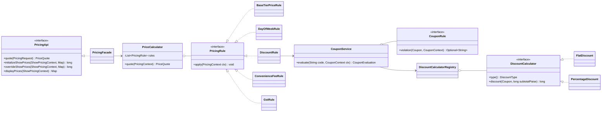

**The pipeline, in order:**

| `@Order` | Rule | What it does to each seat line |
|---|---|---|
| 10 | `BaseTierPriceRule` | `tier = show_category_price[category]` |
| – | *(M4 shipped 10, 40 and 50; M5 added 20 and 30 without touching `PriceCalculator`)* | |
| 20 | `DayOfWeekRule` | Finds the **most specific** active `pricing_rule` for the show date's day of week (THEATER, then CITY, then GLOBAL); adds `tier × value%` or `value` paise. The seeded "Weekend +20%" is one row of this rule |
| 30 | `DiscountRule` | If a code was given: `CouponService.evaluate()` runs every `CouponRule`, then the `DiscountCalculator` for its type computes the discount on `Σ(tier + adjustment)`. The discount is spread across seats with `Allocator.largestRemainder` |
| 40 | `ConvenienceFeeRule` | `fee = convenience-fee-paise` per seat |
| 50 | `GstRule` | `ticketTax = gst% × (tier + adj − discount)`, `feeTax = gst% × fee`, rounded HALF_UP per line |

```java
// what pricing is told about the show (it never asks the show module); the quote call adds the seats
public record ShowPricing(long showId, long cityId, long theaterId, LocalDate showDate) {}

public record SeatPriceLine(long layoutSeatId, String label, long categoryId, long tierPaise,
                            long dayAdjustmentPaise, long discountPaise, long feePaise,
                            long ticketTaxPaise, long feeTaxPaise) {
    public long basePaise()   { return tierPaise + dayAdjustmentPaise; }
    public long amountPaise() { return basePaise() - discountPaise + feePaise + ticketTaxPaise + feeTaxPaise; }
}

public record PriceQuote(List<SeatPriceLine> lines, long subtotalPaise, long discountPaise, long feePaise,
                         long taxPaise, long totalPaise, String appliedCoupon, String dayRuleName) {}
```

**Worked example** (two PREMIUM seats at ₹300, Saturday, coupon `FIRST50` = ₹50 flat, fee ₹20 per seat, GST 18%). Amounts are in paise per seat:

| Step | Amount |
|---|---|
| Tier | 30000 |
| Day adjustment (+20%) | 6000 |
| Discount share (5000 split two ways) | −2500 |
| Ticket after discount | 33500 |
| Ticket GST (18%) | 6030 |
| Fee | 2000 |
| Fee GST (18%) | 360 |
| **Seat total** | **41890** |

For the booking: subtotal 72000 − discount 5000 + fees 4000 + tax 12780 = **83780**.

**Coupon rules** (Specification, in `@Order`, first failure's message wins): `ActiveWindowRule` (10), `MinOrderValueRule` (20), `ScopeRule` (30), `PerUserLimitRule` (40), `GlobalLimitRule` (50). Discount strategies come from a `DiscountCalculatorRegistry` that refuses to start if a `DiscountType` has no calculator. The two limit rules are only early feedback for the customer; the real limits are enforced by the atomic updates in `CouponApi.reserve` (§7.7).

```java
public interface CouponApi {
    void reserve(String code, UUID userId, UUID bookingId, long discountPaise);  // throws CouponInvalidException
    void release(UUID bookingId);                                               // live → RELEASED; no-op if none
    // consume(bookingId): RESERVED → CONSUMED, added with payment confirmation in M6
}
```

### 6.6 payment

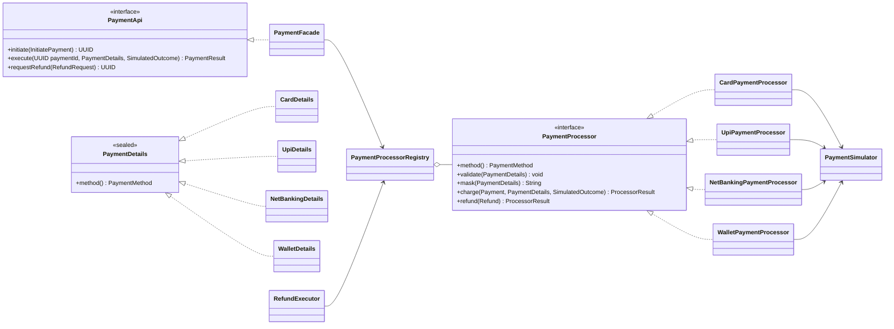

```java
@JsonTypeInfo(use = JsonTypeInfo.Id.NAME, property = "type")
@JsonSubTypes({
    @JsonSubTypes.Type(value = CardDetails.class,       name = "CARD"),
    @JsonSubTypes.Type(value = UpiDetails.class,        name = "UPI"),
    @JsonSubTypes.Type(value = NetBankingDetails.class, name = "NET_BANKING"),
    @JsonSubTypes.Type(value = WalletDetails.class,     name = "WALLET") })
public sealed interface PaymentDetails permits CardDetails, UpiDetails, NetBankingDetails, WalletDetails {
    PaymentMethod method();
}

public record CardDetails(String number, int expiryMonth, int expiryYear, String cvv, String holderName)
        implements PaymentDetails {
    public PaymentMethod method() { return PaymentMethod.CARD; }
    @Override public String toString() { return "CardDetails[redacted]"; }   // never log card data
}
```

| Processor | `validate` | `mask` |
|---|---|---|
| `CardPaymentProcessor` | Luhn check, expiry not in the past, 3–4 digit CVV | `•••• 4242` (only the last 4 digits are ever stored) |
| `UpiPaymentProcessor` | Matches `^[a-zA-Z0-9._-]{2,256}@[a-zA-Z]{2,64}$` | the UPI ID |
| `NetBankingPaymentProcessor` | Bank code is in the configured list | bank code |
| `WalletPaymentProcessor` | Provider is in the configured list | provider |

- **Adapters over one simulator.** Every processor hands `charge`/`refund` to the shared `PaymentSimulator`. A real gateway later would be a new adapter implementing the same interface.
- **The simulator honours `SimulatedOutcome`.** (DELAYED completion runs on `CompletableFuture.delayedExecutor`; no scheduler bean needed.)
  - `SUCCESS` returns a `SIM-…` transaction ID.
  - `FAILURE` returns "Declined by issuer (simulated)".
  - `DELAYED` returns `PENDING` and completes the payment after `payment.simulated-delay` using a `TaskScheduler`, publishing `PaymentSucceeded`. It is in-memory, so a restart loses it; that's acceptable for a simulator.
- **LSP:** every processor supports refunds and returns a `ProcessorResult`; none throws "unsupported".

```java
@Component
class PaymentProcessorRegistry {
    private final Map<PaymentMethod, PaymentProcessor> byMethod = new EnumMap<>(PaymentMethod.class);

    PaymentProcessorRegistry(List<PaymentProcessor> processors) {
        for (PaymentProcessor p : processors) {
            if (byMethod.put(p.method(), p) != null)
                throw new IllegalStateException("Two processors for " + p.method());
        }
        EnumSet<PaymentMethod> missing = EnumSet.allOf(PaymentMethod.class);
        missing.removeAll(byMethod.keySet());
        if (!missing.isEmpty()) throw new IllegalStateException("No processor for " + missing);  // fail at startup
    }

    PaymentProcessor forMethod(PaymentMethod method) { return byMethod.get(method); }
}
```

```java
public interface PaymentApi {
    UUID initiate(InitiatePayment cmd);             // validates details, saves INITIATED; joins the caller's tx
    PaymentResult execute(UUID paymentId, PaymentDetails details, SimulatedOutcome outcome);  // no caller tx
    UUID requestRefund(RefundRequest request);      // joins the caller's tx; the processor runs after commit
    PaymentSummary summary(UUID bookingId);         // payment + refunds, for the booking detail view
}

public record InitiatePayment(UUID bookingId, UUID customerId, String reference, long amountPaise,
                              PaymentDetails details) {}
public record PaymentResult(UUID paymentId, Status status, String providerTxnId, String failureReason) {
    public enum Status { SUCCESS, FAILED, PENDING }
}
public record RefundRequest(UUID bookingId, UUID cancellationId, long amountPaise, RefundReason reason) {}
```

**Refunds are crash-safe.** `requestRefund` (inside the caller's transaction):

1. Increases `payment.refunded_paise` with a conditional update (§7.8).
2. Inserts an `INITIATED` refund.
3. Publishes the internal `RefundRequested` event.

`RefundExecutor` (`@ApplicationModuleListener`) then calls the processor, marks the refund `COMPLETED` and publishes `RefundCompleted`. If the app dies after the commit, the outbox re-delivers `RefundRequested`. The executor skips refunds that aren't `INITIATED`.

### 6.7 booking

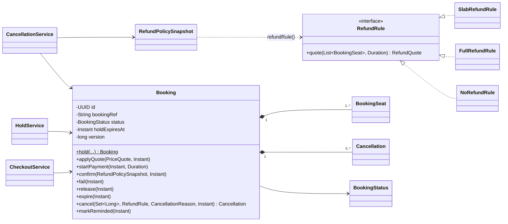

| Class | Responsibility |
|---|---|
| `Booking` (aggregate root) | Owns `BookingSeat`s (an `@ElementCollection` of a record value object) and `Cancellation`s. Every status change goes through `status.transitionTo()`. `@Version` for optimistic locking |
| `BookingRefGenerator` | `BK` + 6 Crockford base-32 characters; retried (up to 3 times) on a unique-index collision |
| `HoldService` | Create a hold, release it, apply or remove a coupon (§8.3, §8.4) |
| `CheckoutService` | Pay, confirm, fail, handle a late payment; uses `TransactionTemplate` for its separate transactions (§8.5) |
| `CancellationService` | Refund preview and cancellation (§8.6) |
| `BookingQueryService` | Booking history and details (ownership-checked) |
| `ShowCancelledListener` | Bulk cancellation when an admin cancels a show (§8.7) |
| `PaymentEventsListener` | `PaymentSucceeded` / `PaymentFailed` → the same `CheckoutService.completePayment` used by the immediate path. Runs with `@ApplicationModuleListener(propagation = NOT_SUPPORTED)` so confirm (tx2) and the late refund (tx3) stay separate transactions |
| `HoldExpiryJob`, `ReminderJob` | `BatchJob` subclasses (§14) |
| `RefundRule` + three strategies, chosen by `RefundPolicySnapshot.refundRule()` | Strategy; the snapshot's one switch picks it (below) |
| `RefundPolicyService` | Admin create/read/update and make-default (clears the old default and flushes first, for `refund_policy_one_default`); `snapshotForShow(showId)` gives the show's policy or the default, called in the confirm transaction |

```java
public interface RefundRule {
    RefundQuote quote(List<BookingSeat> seats, Duration beforeShow);

    /** Refunds percent of the ticket price (amount − fee), plus the fees when refundFees is set. */
    static RefundQuote refund(List<BookingSeat> seats, int percent, boolean refundFees) {
        long ticket = seats.stream().mapToLong(BookingSeat::ticketPaise).sum();
        long fees   = seats.stream().mapToLong(BookingSeat::feePaise).sum();
        long refund = Money.ofPaise(ticket).percent(percent).paise() + (refundFees ? fees : 0);
        return new RefundQuote(seats, percent, refund, ticket + fees - refund);
    }
}

record SlabRefundRule(List<RefundSlab> slabs, boolean refundFees) implements RefundRule {   // slabs: most hours first
    public RefundQuote quote(List<BookingSeat> seats, Duration beforeShow) {
        long hours = beforeShow.toHours();              // 23h59m counts as 23
        int percent = slabs.stream().filter(s -> hours >= s.minHoursBefore())
                .findFirst().map(RefundSlab::percent).orElse(0);
        return RefundRule.refund(seats, percent, refundFees);
    }
}
// FullRefundRule: refund(seats, 100, true). NoRefundRule: refund(seats, 0, false). Both enum singletons.

public record RefundPolicySnapshot(long policyId, String name, RefundPolicyType type, boolean refundFees,
                                   List<RefundSlab> slabs) {
    public RefundRule refundRule() {           // the one switch; the compiler flags a missing case
        return switch (type) {
            case SLAB           -> new SlabRefundRule(slabs, refundFees);
            case FULL           -> FullRefundRule.INSTANCE;
            case NON_REFUNDABLE -> NoRefundRule.INSTANCE;
        };
    }
}
// CancellationService: SHOW_CANCELLED always uses FullRefundRule; CUSTOMER uses the booking's snapshot.
```

### 6.8 notification

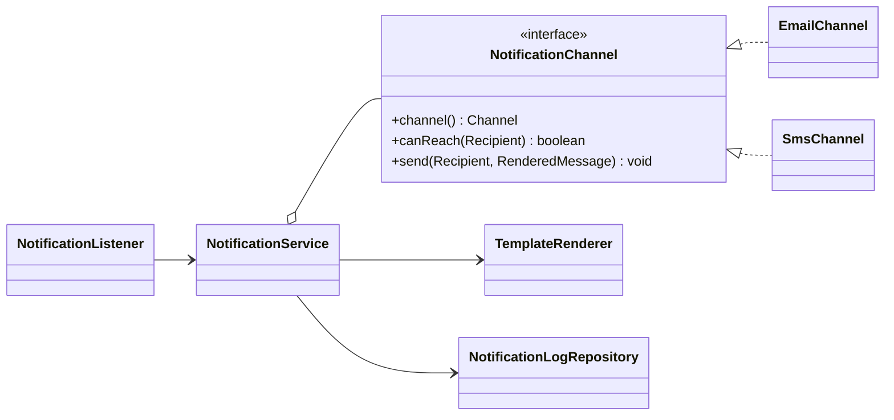

```java
@Component
class NotificationService {
    void notify(NotificationType type, UUID bookingId, String referenceId, UUID userId, Map<String, Object> model) {
        Recipient recipient = userDirectory.recipient(userId);
        for (NotificationChannel channel : channels) {
            if (!channel.canReach(recipient)) continue;
            Optional<NotificationLog> claim = logs.claim(bookingId, type, referenceId, channel.channel());
            if (claim.isEmpty()) continue;                        // already SENT: duplicate event
            try {
                channel.send(recipient, renderer.render(type, channel.channel(), model));
                logs.markSent(claim.get());
            } catch (RuntimeException e) {
                logs.markFailed(claim.get(), e);
                throw e;    // the event publication stays incomplete and is retried (§14)
            }
        }
    }
}
```

- **Channels:** `EmailChannel` uses `JavaMailSender` (Mailpit locally). `SmsChannel` only logs the rendered text.
- **Templates:** Thymeleaf, in `templates/email/*.html` and `templates/sms/*.txt` (TEXT mode).
- **`logs.claim`:** `INSERT … ON CONFLICT DO UPDATE SET status = 'PENDING', attempts = attempts + 1 WHERE status <> 'SENT' RETURNING id`. Empty means already sent; a PENDING or FAILED row is taken over for the retry.
- **No transaction in the listener** (`propagation = NOT_SUPPORTED`): each log update commits on its own, so an email that went out stays SENT when a later channel fails and the event is redelivered.
- **Templates** get preformatted strings (`showTime` in the city's zone, amounts via `Money.inRupees()`); the SMS resolver is a TEXT-mode `ClassLoaderTemplateResolver` limited to `sms/*`.
- **`BookingConfirmed`** is built by booking's `BookingEvents` (ShowApi + CatalogApi for title, theater and zone) inside the confirm transaction.

---

## 7. SQL on the contended paths

All of this is in `SeatInventoryRepository`, `CouponRedemptionRepository` and the payment repository, using JdbcClient. `:now` always comes from the injected `Clock`.

### 7.1 Hold: lock in a fixed order, fail fast, claim all or nothing

```sql
WITH requested AS (
    SELECT show_id, layout_seat_id, status, hold_expires_at
    FROM show_seat
    WHERE show_id = :showId AND layout_seat_id = ANY(:seatIds)
    ORDER BY layout_seat_id
    FOR UPDATE NOWAIT
)
UPDATE show_seat s
SET    status = 'HELD', booking_id = :bookingId, hold_expires_at = :expiresAt, version = s.version + 1
FROM   requested r
WHERE  s.show_id = r.show_id AND s.layout_seat_id = r.layout_seat_id
  AND  (r.status = 'AVAILABLE' OR (r.status = 'HELD' AND r.hold_expires_at < :now))
RETURNING s.layout_seat_id, s.seat_label, s.category_id, r.status AS previous_status;
```

- **Fixed lock order.** Rows are locked in `layout_seat_id` order, so two holds over overlapping seats can't deadlock.
- **`NOWAIT` fails fast.** If another transaction is holding any of the rows, Postgres raises `55P03`. Spring 7 doesn't translate that state for Postgres (it arrives as `UncategorizedSQLException`), so `InventoryFacade` checks the SQL state itself and rethrows `SeatsUnavailableException`. Callers, including the concurrency test, only ever see that one exception.
- **All or nothing.** If the number of rows returned is less than `seatIds.size()`, the repository throws `SeatsUnavailableException(requested − returned)`. The whole transaction rolls back, including the update.
- **Seat IDs are checked first.** They're validated against the cached layout beforehand, so a missing row means "taken", never "doesn't exist".
- **`previous_status` keeps the counter honest.** Only seats that were `AVAILABLE` lower the seats-left counter. A seat taken over from an expired hold was already counted as unavailable.
- **Seat IDs use `IN (:seatIds)`**, not `= ANY(:seatIds)`: Spring's named parameters expand a collection into a list, which works with the ordered `FOR UPDATE NOWAIT` just the same.
- **Counter deltas** are applied after commit by a Lua script that only `INCRBY`s an existing key, so an evicted counter is rebuilt from the database instead of starting from the delta.

### 7.2 Confirm: the seat must still be ours, or free again

```sql
WITH requested AS (
    SELECT show_id, layout_seat_id, status, booking_id, hold_expires_at
    FROM show_seat
    WHERE show_id = :showId AND layout_seat_id = ANY(:seatIds)
    ORDER BY layout_seat_id
    FOR UPDATE                                      -- wait: a paid customer shouldn't fail on a brief lock
)
UPDATE show_seat s
SET    status = 'BOOKED', booking_id = :bookingId, hold_expires_at = NULL, version = s.version + 1
FROM   requested r
WHERE  s.show_id = r.show_id AND s.layout_seat_id = r.layout_seat_id
  AND  (   (r.status = 'HELD' AND r.booking_id = :bookingId)
        OR  r.status = 'AVAILABLE'
        OR (r.status = 'HELD' AND r.hold_expires_at < :now))
RETURNING s.layout_seat_id, r.status AS previous_status;
```

If fewer rows come back than requested, `SeatsUnavailableException` is thrown and the confirm transaction rolls back. `CheckoutService` then runs the late-payment path (§8.5).

### 7.3 Release

```sql
-- held seats (customer release, expiry, payment failure): only rows this booking still owns
UPDATE show_seat
SET    status = 'AVAILABLE', booking_id = NULL, hold_expires_at = NULL, version = version + 1
WHERE  show_id = :showId AND booking_id = :bookingId AND status = 'HELD';

-- booked seats (cancellation): row count must equal seatIds.size(), otherwise throw
UPDATE show_seat
SET    status = 'AVAILABLE', booking_id = NULL, version = version + 1
WHERE  show_id = :showId AND booking_id = :bookingId AND status = 'BOOKED'
  AND  layout_seat_id = ANY(:seatIds);
```

The number of rows changed is added back to the seats-left counter after commit.

### 7.4 Block and unblock (admin)

```sql
UPDATE show_seat SET status = 'BLOCKED', version = version + 1
WHERE  show_id = :showId AND layout_seat_id = ANY(:seatIds) AND status = 'AVAILABLE';

UPDATE show_seat SET status = 'AVAILABLE', version = version + 1
WHERE  show_id = :showId AND layout_seat_id = ANY(:seatIds) AND status = 'BLOCKED';
```

Blocking only affects `AVAILABLE` seats. The response lists the seats that couldn't be blocked because they're held or booked.

### 7.5 Seat map read (lazy expiry)

```sql
SELECT layout_seat_id,
       CASE WHEN status = 'HELD' AND hold_expires_at < :now THEN 'AVAILABLE' ELSE status END AS status
FROM   show_seat
WHERE  show_id = :showId;
```

### 7.6 Seats-left rebuild (when the Redis key is missing)

```sql
SELECT count(*) FROM show_seat
WHERE  show_id = :showId
  AND  (status = 'AVAILABLE' OR (status = 'HELD' AND hold_expires_at < :now));
```

### 7.7 Coupon reserve and release

```sql
-- reserve 1: global limit (0 rows = limit reached or inactive)
UPDATE coupon SET used_count = used_count + 1, version = version + 1
WHERE  id = :couponId AND active AND (max_uses IS NULL OR used_count < max_uses);

-- reserve 2: per-user limit (0 rows = this user has used it up)
INSERT INTO coupon_user_usage (coupon_id, user_id, used_count) VALUES (:couponId, :userId, 1)
ON CONFLICT (coupon_id, user_id)
DO UPDATE SET used_count = coupon_user_usage.used_count + 1
WHERE coupon_user_usage.used_count < :perUserLimit;

-- reserve 3
INSERT INTO coupon_redemption (coupon_id, user_id, booking_id, discount_paise, status)
VALUES (:couponId, :userId, :bookingId, :discountPaise, 'RESERVED');

-- release (RESERVED or CONSUMED → RELEASED), then give the use back
UPDATE coupon_redemption SET status = 'RELEASED', updated_at = :now
WHERE  booking_id = :bookingId AND status <> 'RELEASED'
RETURNING coupon_id, user_id;
UPDATE coupon            SET used_count = used_count - 1 WHERE id = :couponId;
UPDATE coupon_user_usage SET used_count = used_count - 1 WHERE coupon_id = :couponId AND user_id = :userId;
```

All three reserve statements run in the hold's transaction. If any of them changes 0 rows, `CouponInvalidException` is thrown and the whole hold rolls back.

### 7.8 Refund: can never exceed what was paid

```sql
UPDATE payment
SET    refunded_paise = refunded_paise + :amount, version = version + 1
WHERE  booking_id = :bookingId AND status = 'SUCCESS'
  AND  refunded_paise + :amount <= amount_paise
RETURNING id;          -- 0 rows → IllegalStateException; the CHECK constraint is the last line of defence
```

### 7.9 Job selection

```sql
-- hold expiry (graceCutoff = now − payment-grace)
SELECT id FROM booking
WHERE  (status = 'HELD'            AND hold_expires_at < :now)
   OR  (status = 'PAYMENT_PENDING' AND hold_expires_at < :graceCutoff)
ORDER BY hold_expires_at
LIMIT  :batchSize;

-- reminders (horizon = now + reminder lead time)
SELECT id FROM booking
WHERE  status = 'CONFIRMED' AND reminder_sent_at IS NULL
  AND  show_start_time > :now AND show_start_time <= :horizon
ORDER BY show_start_time
LIMIT  :batchSize;
```

Each ID is then processed in its own transaction through the aggregate, so its state-machine rules and `@Version` check apply (§6.1). A booking confirmed less than 2 hours before the show gets its reminder on the next run.

### 7.10 Browse queries

```sql
-- movies now showing in a city (next N days); bookableAfter = now + booking cutoff
SELECT movie_id, min(start_time) AS next_show
FROM   show
WHERE  city_id = :cityId AND status = 'OPEN' AND show_date BETWEEN :today AND :lastDay
  AND  start_time > :bookableAfter
GROUP  BY movie_id;

-- date strip
SELECT DISTINCT show_date
FROM   show
WHERE  city_id = :cityId AND movie_id = :movieId AND status = 'OPEN'
  AND  show_date BETWEEN :today AND :lastDay
  AND  start_time > :bookableAfter
ORDER  BY show_date;

-- one day of shows for a movie: unfiltered, cached; filters are applied in memory
SELECT id, theater_id, screen_id, start_time, language, format, price_from_paise, total_seats
FROM   show
WHERE  city_id = :cityId AND movie_id = :movieId AND show_date = :date AND status = 'OPEN'
ORDER  BY theater_id, start_time;
```

All three use `show_browse_idx`. The third query isn't filtered by time, so the cached list stays valid all day; `BrowseService` applies the booking cutoff when it reads the list.

### 7.11 Idempotency claim

```sql
INSERT INTO idempotency_record (user_id, idem_key, request_hash, status, expires_at)
VALUES (:userId, :key, :hash, 'IN_PROGRESS', :expiresAt)
ON CONFLICT (user_id, idem_key) DO UPDATE
    SET request_hash = EXCLUDED.request_hash, status = 'IN_PROGRESS',
        response_status = NULL, response_body = NULL, created_at = :now, expires_at = EXCLUDED.expires_at
    WHERE idempotency_record.expires_at < :now          -- an expired key may be reused
RETURNING user_id;
```

| Result | What happens |
|---|---|
| 1 row | Run the request, then save the response with `status = COMPLETED`. 2xx and 4xx responses are saved; on a 5xx the record is deleted so the client can retry |
| 0 rows, different hash | 409 `IDEMPOTENCY_KEY_REUSED` |
| 0 rows, `IN_PROGRESS` | 409 `IDEMPOTENCY_IN_PROGRESS`; the client retries shortly |
| 0 rows, `COMPLETED` | Replay the saved status and body |

The claim is a single auto-committed statement run by `IdempotencyAspect` around the controller method, before the business transaction starts, so it isn't rolled back with it. Business errors (`DomainException`) are saved as `{code, detail, details}` and replayed by rethrowing them; anything unexpected deletes the record. The request hash covers method, path and the `@RequestBody` argument serialised to JSON.

---

## 8. Core flows

### 8.1 Admin creates a show

`ShowAdminService.create()` runs in one transaction:

1. **Load and check** the screen, movie and screen's active layout through `CatalogApi`. Each must be active; an inactive one is `VALIDATION_FAILED`.
2. **Work out the times.**
   - `start_time` must be in the future.
   - `end_time = start + movie duration`.
   - `blocked_until = end + cleaning buffer`.
   - `show_date` comes from `ShowDateResolver` unless the admin gives it.
3. **Insert the show** as `SCHEDULED`. The `show_no_overlap` constraint rejects an overlap with `23P01`, which becomes `SHOW_OVERLAP` (409).
4. **Create the seat rows:** `inventoryApi.initializeSeats(showId, layout)` batch-inserts one `show_seat` per layout seat. Layout seats marked `BLOCKED` start as `BLOCKED`. It returns the sellable count, which becomes `total_seats`.
5. **Set the prices:** `pricingApi.initializeShowPrices(ctx, overrides)` copies `theater_category_price` into `show_category_price`, applies the admin's overrides, and returns `price_from`. That's the lowest category price after the day-of-week rule.

**Opening a show** (`SCHEDULED → OPEN`) starts the seats-left counter and clears the day cache after commit.

### 8.2 Browse

`GET /movies/{movieId}/shows?cityId&date&slot&language&format`:

1. **Load the day.** `CachingShowQueryService.showsForDay(cityId, movieId, date)` returns the unfiltered rows from Redis; on a cache miss it reads the database (§7.10).
2. **Filter** in `BrowseService`:
   - drop shows at or past `start − booking cutoff`;
   - keep shows whose `start_time` falls inside any selected slot window;
   - match language and format.
3. **Group and fill in.** Group the shows by theater, then add:
   - theater details from `catalog.theaters(ids)` (cached);
   - `seatsLeft` from `SeatAvailabilityReader` (one Redis `MGET`);
   - an availability badge: `SOLD_OUT` at 0 seats left, `FILLING_FAST` below 20% of `total_seats`, otherwise `AVAILABLE`.
4. **Sort and trim.** Theaters are sorted by name and showtimes by start time. Theaters with nothing left after filtering are dropped.

### 8.3 Hold seats

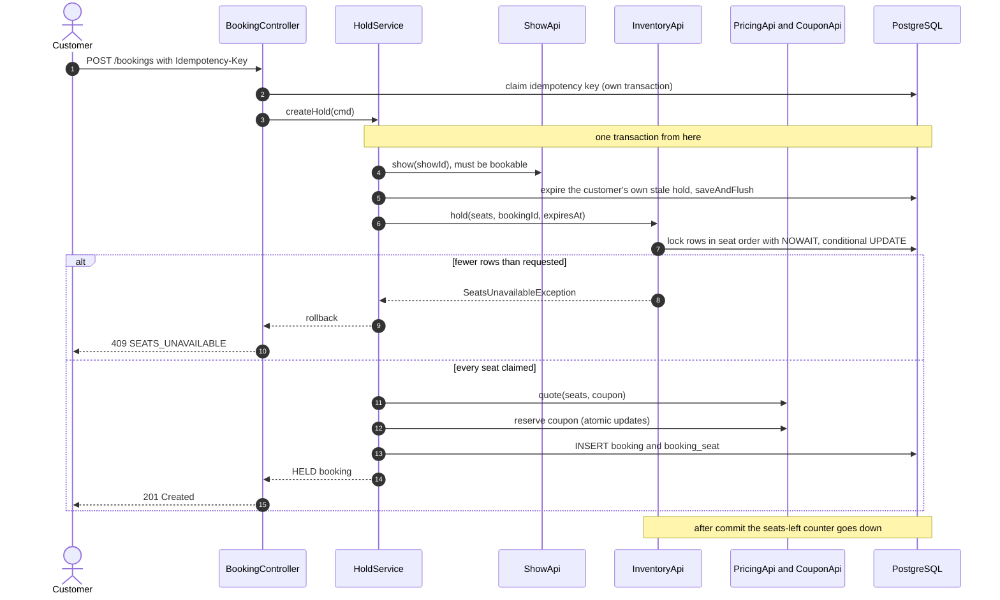

1. `show.isBookable(now, bookingCutoff)`, otherwise `SHOW_NOT_BOOKABLE`.
2. Seat checks:
   - between 1 and `max-seats-per-booking` seats;
   - no duplicates;
   Otherwise `VALIDATION_FAILED`. Seat IDs that aren't part of the show are reported by the claim itself as
   `SEATS_UNAVAILABLE` (inventory finds no free row for them), which saves booking a catalog lookup.
3. **The customer's existing hold on this show.**
   - If it has expired (`HELD` past `hold_expires_at`, or `PAYMENT_PENDING` past the grace period), expire it, release its seats and coupon, and **`saveAndFlush`**. Hibernate flushes inserts before updates, so without the explicit flush the new booking's insert would hit `booking_one_active_hold`.
   - If it's still live, return `ACTIVE_HOLD_EXISTS` with its `bookingId`.
4. Claim the seats (§7.1). `show_seat.booking_id` points at a booking that doesn't exist yet; that's fine because the foreign key is **deferred** to commit.
5. Price the seats, reserve the coupon (§7.7), and insert the booking with its frozen per-seat amounts and totals.
6. Any exception rolls back everything: seats, coupon counters and booking. Two simultaneous holds by the same customer are stopped by `booking_one_active_hold` at commit, which becomes `ACTIVE_HOLD_EXISTS`.

### 8.4 Apply or remove a coupon on a hold

`PUT /bookings/{id}/coupon` runs in one transaction:

1. **Checks:** the caller owns the booking, it's `HELD`, and the hold hasn't expired (`HOLD_EXPIRED`).
2. **Release the current coupon:** `couponApi.release(bookingId)` gives back any coupon already applied.
3. **Re-price:** `pricingApi.quote(...)` with the new code, using the seats already on the booking.
4. **Reserve the new coupon:** `couponApi.reserve(...)`.
5. **Store the result:** `booking.applyQuote(quote, now)` saves the new breakdown and totals.

`DELETE /bookings/{id}/coupon` does steps 1–3 without a code and then step 5. The seats and the hold expiry don't change.

### 8.5 Pay and confirm

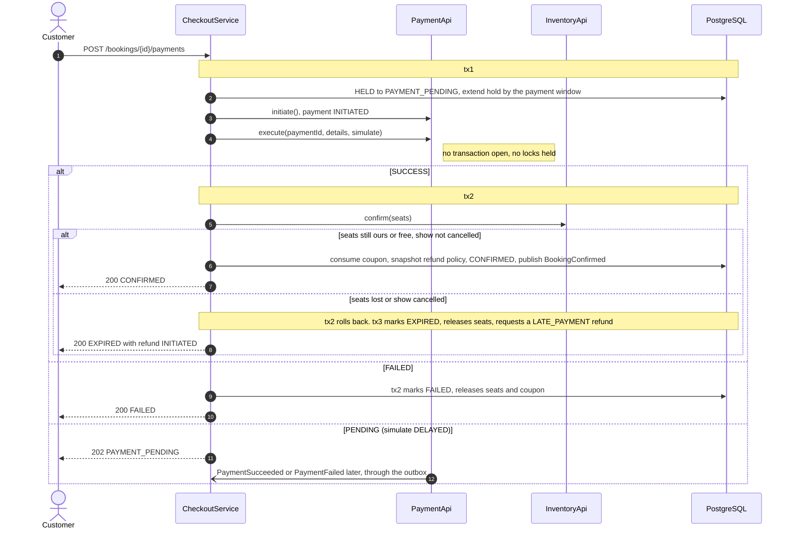

`CheckoutService.pay()` uses `TransactionTemplate` for its separate transactions. `@Transactional` on private or self-called methods is ignored because of Spring's proxies.

1. **tx1:**
   - `booking.startPayment(now, paymentWindow)` requires `HELD` and a live hold (`HOLD_EXPIRED` otherwise). It sets `hold_expires_at = max(current, now + 5 min)`.
   - `paymentApi.initiate(...)` validates the payment details (400 if invalid, and the booking stays `HELD`) and saves the payment as `INITIATED`.
2. **`paymentApi.execute(...)`** runs with no transaction open, so no database locks are held during the call to the provider.
3. **`onPaymentResult(bookingId, paymentId, status)`** handles both the immediate result and the delayed events.
   - **SUCCESS → confirm (tx2):**
     - If the booking is already `CONFIRMED`, return: this is a re-delivered event.
     - If it's no longer `PAYMENT_PENDING` (the sweeper expired it), or the show is `CANCELLED`, go to the late path.
     - Otherwise run `inventoryApi.confirm` (§7.2), `couponApi.consume`, and snapshot the show's refund policy (or the default one). Then `booking.confirm()` and publish `BookingConfirmed`.
     - A `SeatsUnavailableException`, or an `OptimisticLockingFailureException` because the sweeper won a race, rolls tx2 back. The booking is reloaded and the late path runs.
   - **Late path (tx3):**
     - If the booking still holds seats: `expire`, `releaseHeld` and release the coupon.
     - Then `paymentApi.requestRefund(bookingId, null, total, LATE_PAYMENT)`. If a late-payment refund already exists, the unique index `refund_one_late_payment` rejects the duplicate and it's ignored.
   - **FAILED (tx2):** `booking.fail()`, `releaseHeld`, release the coupon. If the booking was already expired, nothing changes.
   - **PENDING:** return 202. The booking stays `PAYMENT_PENDING` until the event arrives.

A declined payment is a normal result (200 with `status: FAILED`), not an error, so the idempotent replay of the request is simple.

### 8.6 Cancel and refund (customer)

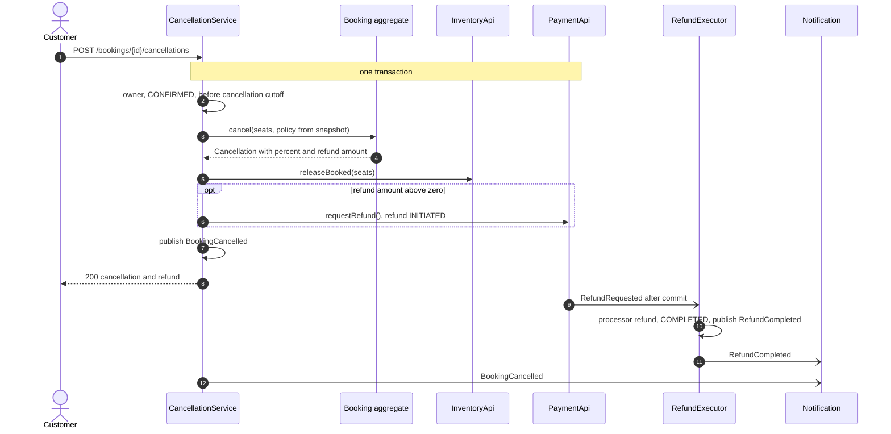

1. **Checks:**
   - the caller owns the booking (`NOT_FOUND` otherwise);
   - it's `CONFIRMED` (`INVALID_STATE`);
   - `now < show_start − cancellation cutoff` (`CANCELLATION_CLOSED`).
2. **Choose the seats:** the requested seats, which must all be `ACTIVE` seats of this booking, or every `ACTIVE` seat if none are given.
3. **Cancel on the booking.** The rule comes from `booking.refundPolicySnapshot.refundRule()` (a switch over the policy type; SHOW_CANCELLED will use `FullRefundRule`). The booking row is locked first (`findOwnForUpdate`, `SELECT … FOR UPDATE`) so concurrent cancels run one after the other. `booking.cancel(...)` computes the `RefundQuote`, creates the `Cancellation`, marks the seats, and moves the booking to `CANCELLED` if no active seats are left.
4. **Release the seats:** `inventoryApi.releaseBooked(...)`.
5. **Request the refund** if `refundPaise > 0`: `paymentApi.requestRefund(bookingId, cancellationId, refundPaise, CUSTOMER)`.
6. **Release the coupon** if the booking is now fully `CANCELLED` (D-17).
7. **Publish** `BookingCancelled`.

The refund preview (`GET /bookings/{id}/refund-quote`) runs steps 1–3 read-only and returns the `RefundQuote`.

### 8.7 Admin cancels a show

1. **`ShowAdminService.cancel()`:** `show.cancel()` publishes `ShowCancelled`, and the day cache is cleared after commit.
2. **`ShowCancelledListener`** (booking module) pages through the show's bookings with status `HELD` or `CONFIRMED`. Each one is handled in its own transaction:
   - `HELD` → `release()` (`RELEASED`), freeing the seats and the coupon.
   - `CONFIRMED` → `CancellationService.cancelAll(bookingId, SHOW_CANCELLED)`. `FullRefundPolicy` refunds 100% including fees, and there's no cutoff check.
3. **`PAYMENT_PENDING` bookings are left alone** (but still locked, see below). When their payment finishes, confirm sees the show isn't open and takes the late path, so they're refunded too. Paying for a hold on a cancelled show is refused (`SHOW_NOT_BOOKABLE`).
   - **The race:** confirm (tx2) locks the booking row *before* checking the show, and `cancelForShow` locks it too (the listener's query includes `PAYMENT_PENDING`). Whichever runs second sees the other's result: either the listener finds the booking CONFIRMED and refunds it, or confirm finds the show cancelled.
   - The listener loads all affected booking ids at once (no paging; ponytail note), handles each via `CancellationService.cancelForShow` in its own transaction, and rethrows at the end if any failed.
4. **Safe to re-run.** Bookings already handled are terminal and are skipped. If the listener fails halfway, its event publication stays incomplete and `EventRetryJob` re-delivers it.

### 8.8 Hold expiry sweeper

For each ID from §7.9, `HoldExpiryJob.process(id)` runs in its own transaction:

0. **Re-check** `booking.isDueToExpire(now, paymentGrace)`: the booking may have moved on since the batch was picked (a customer who started paying has a longer hold, and PAYMENT_PENDING → EXPIRED is a legal move, so the state machine alone wouldn't stop it).
1. `booking.expire(now)`. If the booking was confirmed in the meantime, this throws `IllegalTransitionException` (or an optimistic-lock failure), and the booking is skipped.
2. `inventoryApi.releaseHeld(showId, id)` releases only the rows this booking still owns. Seats already taken over by another booking aren't touched.
3. `couponApi.release(id)`.
4. After commit, the counter goes up by the number of rows released.

### 8.9 Reminder

For each ID from §7.9, `ReminderJob.process(id)` runs `booking.markReminded(now)` and publishes `ReminderDue` (with the show details from `ShowApi`) in the same transaction. That gives it outbox guarantees. `process` first re-checks `booking.isDueForReminder(now, leadTime)` (confirmed, not reminded, show within the lead time), so a booking cancelled after being picked is skipped. `ReminderDue.seatLabels` lists active seats only.

### 8.10 Notification delivery (outbox)

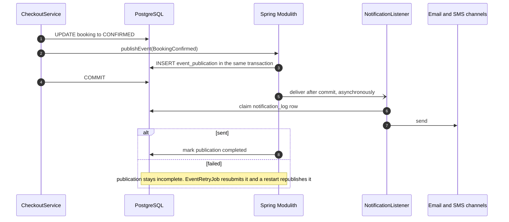

---

## 9. Concurrency: every race and how it resolves

| Race | Mechanism | Outcome |
|---|---|---|
| 500 customers grab the same seat | `FOR UPDATE NOWAIT` + conditional UPDATE on the single-owner row | Exactly one 201; everyone else 409 `SEATS_UNAVAILABLE` |
| Overlapping multi-seat holds (A: 1,2 and B: 2,3) | Rows locked in `layout_seat_id` order | No deadlock; at most one of them gets seat 2, and each hold is all or nothing |
| A seat's hold expired but the sweeper hasn't run | Lazy expiry in every claim and read | The next customer can take it immediately |
| The same customer double-clicks "Hold" | Idempotency key replay, plus `booking_one_active_hold` | One booking |
| The hold expires while the customer is paying | Payment window extension + sweeper grace period + late path | Confirmed if the seats are still ours or free, otherwise refunded automatically |
| Sweeper and confirm touch the same booking | `@Version` + state machine | One wins; the other re-reads and takes the correct path |
| Two customers take a coupon's last use | Conditional `UPDATE … used_count < max_uses` | Exactly `max_uses` reservations |
| One customer uses a coupon on two holds at once | Upsert with `WHERE used_count < per_user_limit` | The per-user limit holds |
| A retried cancel request | Idempotency key + seats must be `ACTIVE` + `refund.cancellation_id UNIQUE` + CHECK `refunded ≤ amount` | Refunded once |
| The admin re-prices a show during a hold | Per-seat amounts and totals frozen on the booking at hold time | The customer pays the quoted price |
| Two admins create overlapping shows | `show_no_overlap` exclusion constraint | The second gets 409 `SHOW_OVERLAP` |
| Two app instances run the sweeper | ShedLock | Only one runs each round |
| An event is delivered twice | `notification_log` claim, refund status check, booking state checks | No duplicate email, refund or state change |
| A payment event arrives after the show was cancelled | Confirm checks the show status | Late path, refunded |

---

## 10. REST API

**Headers** (set by the gateway): `X-User-Id`, `X-User-Role`, `X-User-Email`, `X-User-Phone`, `X-User-Name`. Endpoints marked 🔑 require `Idempotency-Key` (a UUID from the client). The gateway already restricts `/api/v1/admin/**` to admins; an `AdminOnlyInterceptor` in the app checks the role header again (403).

**Paged responses:** `?page=0&size=20` returns `{ "items": [...], "page": 0, "size": 20, "totalItems": 57 }`.

### 10.1 Customer

| Method and path | Purpose | Success |
|---|---|---|
| `GET /api/v1/cities` | Active cities | 200 |
| `GET /api/v1/cities/{cityId}/movies` | Movies now showing (next 7 days) | 200 |
| `GET /api/v1/movies/{movieId}` | Movie details | 200 |
| `GET /api/v1/movies/{movieId}/dates?cityId=` | Date strip | 200 |
| `GET /api/v1/movies/{movieId}/shows?cityId&date&slot&language&format` | Theaters with their showtimes | 200 |
| `GET /api/v1/shows/{showId}/seats` | Seat map | 200 |
| `POST /api/v1/bookings` 🔑 | Hold seats | 201 |
| `PUT /api/v1/bookings/{id}/coupon` | Apply a coupon | 200 |
| `DELETE /api/v1/bookings/{id}/coupon` | Remove the coupon | 200 |
| `POST /api/v1/bookings/{id}/release` | Let the hold go | 200 |
| `POST /api/v1/bookings/{id}/payments` 🔑 | Pay | 200 / 202 |
| `GET /api/v1/bookings/{id}/refund-quote?seatIds=` | Refund preview | 200 |
| `POST /api/v1/bookings/{id}/cancellations` 🔑 | Cancel all or some seats | 200 |
| `GET /api/v1/bookings?view=UPCOMING\|PAST\|CANCELLED&page&size` | Booking history | 200 |
| `GET /api/v1/bookings/{id}` | Booking details (seats, cancellations, payment and refund status) | 200 |

History views:

- `UPCOMING` = `CONFIRMED` and the show hasn't started.
- `PAST` = `CONFIRMED` and the show has started.
- `CANCELLED` = status `CANCELLED`.

Holds that expired, failed or were released don't appear in history. Payment and refund status on the detail view come from `PaymentApi.summary(bookingId)`.

- `UPCOMING` is soonest first; `PAST` and `CANCELLED` are latest first. Items carry `movieTitle`, `theaterName`, `seats` (still booked) and `cancelledSeats`; the page wrapper is `{items, page, size, totalItems, totalPages}` (size 1–50, default 10).
- A page costs a handful of queries: the page itself, one batch for its seats (`@BatchSize(50)` on `Booking.seats`), `ShowApi.shows(ids)` and the catalog batch lookups.
- The detail response keeps every `BookingResponse` field at the top level (`@JsonUnwrapped`) and adds `movieTitle`, `theaterName`, `cancellations[]` and `payment {method, paidWith, amountPaise, refunds[{refundId, cancellationId, amountPaise, reason, status}]}` (null until paid).

**Browse response**

```json
GET /api/v1/movies/42/shows?cityId=1&date=2026-10-03&slot=EVENING,NIGHT
{
  "movie": { "id": 42, "title": "…", "durationMin": 152, "certification": "UA" },
  "date": "2026-10-03",
  "theaters": [
    { "theater": { "theaterId": 7, "name": "PVR Forum", "area": "Koramangala" },
      "shows": [
        { "showId": 901, "startTime": "2026-10-03T18:15:00+05:30", "language": "HI", "format": "2D",
          "priceFromPaise": 30000, "seatsLeft": 34, "availability": "FILLING_FAST" } ] } ]
}
```

**Seat map**

```json
GET /api/v1/shows/901/seats
{
  "showId": 901, "screen": "Audi 2", "gridRows": 12, "gridCols": 20,
  "categories": [ { "id": 1, "code": "REGULAR", "name": "Regular", "pricePaise": 30000 },
                  { "id": 2, "code": "PREMIUM", "name": "Premium", "pricePaise": 36000 } ],
  "seats": [ { "seatId": 5012, "label": "F7", "row": 6, "col": 7, "categoryId": 2,
               "type": "NORMAL", "status": "AVAILABLE" } ]
}
```

Category prices here are the tier price plus the day-of-week adjustment, before fees and GST.

**Hold**

```json
POST /api/v1/bookings
Idempotency-Key: 6f1c2a9e-…
{ "showId": 901, "seatIds": [5012, 5013], "couponCode": "FIRST50" }

201 Created
{
  "bookingId": "0192…", "bookingRef": "BK7X9Q2M", "status": "HELD",
  "holdExpiresAt": "2026-10-02T12:48:00Z",
  "seats": [ { "seatId": 5012, "label": "F7", "category": "PREMIUM", "amountPaise": 41890 },
             { "seatId": 5013, "label": "F8", "category": "PREMIUM", "amountPaise": 41890 } ],
  "price": { "tierPaise": 60000, "dayAdjustmentPaise": 12000, "discountPaise": 5000,
             "feePaise": 4000, "taxPaise": 12780, "totalPaise": 83780,
             "dayRule": "Weekend +20%", "coupon": "FIRST50" }
}
```

**Pay**

```json
POST /api/v1/bookings/0192…/payments
Idempotency-Key: 91be…
{ "details": { "type": "UPI", "vpa": "user@okbank" }, "simulate": "SUCCESS" }

200 → { "paymentId": "…", "paymentStatus": "SUCCESS",
        "booking": { "status": "CONFIRMED", "bookingRef": "BK7X9Q2M" } }
200 → { "paymentId": "…", "paymentStatus": "FAILED", "failureReason": "Declined by issuer (simulated)",
        "booking": { "status": "FAILED" } }
200 → { "paymentId": "…", "paymentStatus": "SUCCESS", "booking": { "status": "EXPIRED" },
        "refund": { "status": "INITIATED", "amountPaise": 83780, "reason": "LATE_PAYMENT" } }
202 → { "paymentId": "…", "paymentStatus": "PENDING", "booking": { "status": "PAYMENT_PENDING" } }
```

`simulate` is optional and defaults to `SUCCESS`. `method` is taken from `details.type`.

**Refund preview and cancel**

```jsonc
GET /api/v1/bookings/0192…/refund-quote?seatIds=5013
200 → { "seatIds": [5013], "refundPercent": 50, "refundPaise": 19765, "nonRefundablePaise": 22125,
        "policy": "Standard", "hoursBeforeShow": 9 }

POST /api/v1/bookings/0192…/cancellations
Idempotency-Key: 3d7a…
{ "seatIds": [5013] }            // omit seatIds to cancel every active seat
200 → { "cancellationId": "…", "refundPercent": 50, "refundPaise": 19765,
        "refund": { "status": "INITIATED" }, "booking": { "status": "CONFIRMED", "activeSeats": 1 } }
```

The math for seat F8, which cost 41890:

- The fee part (fee 2000 + GST on the fee 360) is 2360, so the ticket part is 39530.
- The show is 9 hours away, so the 4–24 hour slab applies: 50% of 39530 = **19765** refunded.
- Fees aren't refundable under this policy, so 41890 − 19765 = **22125** is kept.

### 10.2 Admin (`/api/v1/admin`)

| Resource | Endpoints |
|---|---|
| Cities | `POST /cities`, `PUT /cities/{id}`, `POST /cities/{id}/deactivate` |
| Theaters | `POST /theaters`, `GET /theaters/{id}` (with screens), `PUT /theaters/{id}` (city can't change), `POST /theaters/{id}/deactivate`, `PUT /theaters/{id}/prices` |
| Screens | `POST /theaters/{id}/screens`, `PUT /screens/{id}`, `POST /screens/{id}/deactivate` |
| Layouts | `POST /screens/{id}/layouts` (draft), `PUT /layouts/{id}` (draft only), `POST /layouts/{id}/activate`, `GET /screens/{id}/layouts` |
| Movies | `POST /movies`, `PUT /movies/{id}`, `POST /movies/{id}/deactivate` |
| Shows | `POST /shows`, `GET /shows?theaterId&date`, `PUT /shows/{id}/prices`, `POST /shows/{id}/open`, `POST /shows/{id}/cancel`, `POST /shows/{id}/seats/block`, `POST /shows/{id}/seats/unblock` |
| Pricing rules | `POST /pricing-rules`, `GET /pricing-rules`, `PUT /pricing-rules/{id}`, `DELETE /pricing-rules/{id}` |
| Coupons | `POST /coupons`, `GET /coupons`, `PUT /coupons/{id}`, `POST /coupons/{id}/deactivate` |
| Refund policies | `POST /refund-policies`, `GET /refund-policies`, `PUT /refund-policies/{id}`, `POST /refund-policies/{id}/make-default` |

```json
POST /api/v1/admin/screens/12/layouts
{ "rows": [ { "label": "A", "segments": [ { "from": 1, "to": 8, "category": "REGULAR" },
                                          { "aisle": 2 },
                                          { "from": 9, "to": 16, "category": "REGULAR" } ] } ],
  "blocked": ["A5"], "wheelchair": ["J7", "J8"] }

POST /api/v1/admin/shows
{ "movieId": 42, "screenId": 12, "startTime": "2026-10-03T18:15:00+05:30",
  "language": "HI", "format": "2D", "refundPolicyId": null,
  "priceOverrides": { "PREMIUM": 32000 } }

POST /api/v1/admin/coupons
{ "code": "FIRST50", "discountType": "FLAT", "discountValue": 5000, "minOrderPaise": 30000,
  "validFrom": "2026-10-01T00:00:00+05:30", "validTo": "2026-10-31T23:59:59+05:30",
  "maxUses": 1000, "perUserLimit": 1, "scopes": [ { "scopeType": "CITY", "scopeId": 1 } ] }

POST /api/v1/admin/refund-policies
{ "name": "Standard", "type": "SLAB", "refundFees": false,
  "slabs": [ { "minHoursBefore": 24, "percent": 100 }, { "minHoursBefore": 4, "percent": 50 },
             { "minHoursBefore": 0, "percent": 0 } ] }

POST /api/v1/admin/pricing-rules
{ "name": "Weekend +20%", "scopeType": "GLOBAL", "daysOfWeek": [6, 7],
  "adjustmentType": "PERCENT", "adjustmentValue": 20 }
```

---

## 11. Errors

Every error is a `ProblemDetail` with a stable `code`, plus extra fields where they help:

```json
{ "type": "about:blank", "title": "Seats unavailable", "status": 409, "code": "SEATS_UNAVAILABLE",
  "detail": "1 of the selected seats was just taken.", "unavailableSeatIds": [5013],
  "instance": "/api/v1/bookings" }
```

| HTTP | Code | When |
|---|---|---|
| 400 | `VALIDATION_FAILED` | Bad input: too many seats, unknown seat, invalid card/UPI details … (field errors in `errors[]`) |
| 401 | `UNAUTHENTICATED` | Missing `X-User-Id` |
| 403 | `FORBIDDEN` | Non-admin on an admin path (backup check) |
| 404 | `NOT_FOUND` | Unknown ID, **or a booking owned by someone else**, so the API doesn't reveal that it exists |
| 409 | `ALREADY_EXISTS` | Admin creates or renames something to a name already taken (city, theater …) |
| 409 | `SEATS_UNAVAILABLE` | Seat taken or locked (`55P03`) |
| 409 | `ACTIVE_HOLD_EXISTS` | The customer already has a live hold on this show (`bookingId` returned) |
| 409 | `INVALID_STATE` | Illegal state transition, or an action the current state doesn't allow (e.g. editing an active layout) |
| 409 | `CONCURRENT_UPDATE` | Optimistic-lock conflict; safe to retry |
| 409 | `SHOW_OVERLAP` | `show_no_overlap` violation (`23P01`) |
| 409 | `IDEMPOTENCY_KEY_REUSED` | Same key, different request |
| 409 | `IDEMPOTENCY_IN_PROGRESS` | Same key still being processed |
| 410 | `HOLD_EXPIRED` | Paying for, or changing the coupon on, an expired hold |
| 422 | `COUPON_INVALID` | The message from the failing `CouponRule`, or a limit reached at reserve time |
| 422 | `SHOW_NOT_BOOKABLE` | Show not open, cancelled, or past the booking cutoff |
| 422 | `CANCELLATION_CLOSED` | Past the cancellation cutoff |
| 500 | `INTERNAL_ERROR` | Anything unexpected (no internals in the response) |

**Mapping database errors.** `GlobalExceptionHandler` looks at the SQL state and the constraint name:

| Database error | Maps to |
|---|---|
| `23P01` on `show_no_overlap` | `SHOW_OVERLAP` (caught in `ShowAdminService`; `ConstraintViolations.isViolationOf` matches the quoted name in the driver message, because Hibernate doesn't extract names for `23P01`) |
| `23505` on `booking_one_active_hold` | `ACTIVE_HOLD_EXISTS` |
| `23505` on `payment_one_success` | `INVALID_STATE` |
| `23505` on `refund_one_late_payment` | Ignored where it's caught (the refund was already requested) |
| `55P03` (lock not available) | `SEATS_UNAVAILABLE` |
| `40P01` (deadlock) or `OptimisticLockingFailureException` | `CONCURRENT_UPDATE` |

---

## 12. Transactions

| Operation | Transactions | Notes |
|---|---|---|
| Hold | 1 (booking + inventory + pricing + coupon) | Possible because it's one database; the idempotency claim is separate (`REQUIRES_NEW`) |
| Apply or remove coupon | 1 | |
| Pay | tx1 → provider call with no transaction → tx2 (and tx3 on the late path) | Never hold row locks during an external call |
| Delayed payment completion | 1 in payment (publishes an event) → 1 in booking (listener) | |
| Cancel | 1 (cancellation + seats + refund `INITIATED` + event) → refund executed after commit | |
| Admin cancels show | 1 (show + event) → 1 per booking in the listener | |
| Sweeper and reminder jobs | 1 per booking | `BatchJob` |
| Event listeners | 1 per event (`@ApplicationModuleListener` = async + `REQUIRES_NEW` + after commit) | |

Every event is published **inside** its transaction (outbox) and handled only **after** commit.

---

## 13. Caching (Redis)

| Key | Value | Time to live | Invalidated by |
|---|---|---|---|
| `show-day:{cityId}:{movieId}:{date}` | Unfiltered show rows (JSON) | 60 s | `ShowCacheEvictor` after commit on show create, open, cancel or price change |
| `seats-left:{showId}` | Integer | 10 min | `INCRBY`/`DECRBY` after commit; rebuilt from §7.6 on a miss |
| `catalog:*` | Layouts, theaters, movies | – | **Not built in v1**: primary-key lookups, cheap enough; add when profiling says so (layouts first) |

- **Counter updates only after commit.** Changes publish an event handled by `@TransactionalEventListener` (after commit), so a rolled-back change never touches Redis. Admin block/unblock just deletes the counter (rebuilt on the next read); holds (M4) will `INCRBY`/`DECRBY`.
- **Show-day eviction** works the same way: `ShowListingChanged` (open, cancel, re-price) → `CachingShowQueryService` deletes the key after commit.
- **Redis failures are logged, not fatal.** The counter is best-effort, and its time-to-live corrects any drift.
- **The seat map is never cached.** It's always read from Postgres (§7.5).

---

## 14. Scheduled jobs

```java
@Configuration
@EnableScheduling
@EnableSchedulerLock(defaultLockAtMostFor = "PT2M")
class SchedulingConfig {
    @Bean
    LockProvider lockProvider(DataSource dataSource) {
        return new JdbcTemplateLockProvider(JdbcTemplateLockProvider.Configuration.builder()
                .withJdbcTemplate(new JdbcTemplate(dataSource))
                .usingDbTime()
                .build());
    }
}
```

`jobs.enabled` (top-level, default true) switches the schedules off; `src/test/resources/application.properties` sets it false so no job fires mid-test, and tests call `runOnce()`. The lock provider and `@EnableSchedulerLock` stay on either way. `booking.payment-grace` (PT2M) is the sweeper's grace for pending payments.

| Job | Schedule | ShedLock name | What it does |
|---|---|---|---|
| `HoldExpiryJob` | every 30 s | `holdExpiry` | Expires held and payment-pending bookings past their time (§8.8) |
| `ReminderJob` | every 5 min | `showReminder` | Marks bookings as reminded and publishes `ReminderDue` (§8.9) |
| `EventPublicationJobs.retryFailed` | every 1 min | `eventRetry` | `resubmitIncompletePublications(options)` with a filter: published over 1 min ago and fewer than 10 attempts (see note) |
| `EventPublicationJobs.deleteOldCompleted` | daily 03:30 IST | `eventCleanup` | `CompletedEventPublications.deletePublicationsOlderThan(7 days)` |
| `IdempotencyCleanupJob` | hourly | `idempotencyCleanup` | `DELETE FROM idempotency_record WHERE expires_at < :now` |

**Modulith 2.1.1 note:** the JDBC `findFailedPublications` query is `STATUS = 'FAILED' OR (STATUS IS NULL AND COMPLETION_DATE IS NULL) AND PUBLICATION_DATE < ?`, so the minimum age only applies to legacy rows and every FAILED row is resubmitted however new (`withMinAge` and `resubmitIncompletePublicationsOlderThan` both go through it). The age is therefore checked in our filter. Only FAILED rows are picked; a delivery left PROCESSING by a crash is picked up by `republish-outstanding-events-on-restart`.

---

## 15. Events

All events are Java records in the publishing module's root package. They carry everything their listeners need.

```java
// show
public record ShowCancelled(long showId, Instant cancelledAt) {}

// booking
public record BookingConfirmed(UUID bookingId, String bookingRef, UUID userId, String movieTitle,
                               String theaterName, Instant showStartTime, ZoneId zone,
                               List<String> seatLabels, long totalPaise) {}
public record BookingCancelled(UUID bookingId, String bookingRef, UUID userId, UUID cancellationId,
                               CancellationReason reason, List<String> seatLabels,
                               long refundPaise, boolean fullyCancelled) {}
public record ReminderDue(UUID bookingId, String bookingRef, UUID userId, String movieTitle,
                          String theaterName, Instant showStartTime, ZoneId zone, List<String> seatLabels) {}

// payment
public record PaymentSucceeded(UUID paymentId, UUID bookingId) {}
public record PaymentFailed(UUID paymentId, UUID bookingId, String reason) {}
public record RefundCompleted(UUID refundId, UUID bookingId, UUID customerId, String reference, long amountPaise,
                              RefundReason reason) {}
record RefundRequested(UUID refundId) {}          // payment-internal
```

| Event | Publisher | Listener | Notification type |
|---|---|---|---|
| `ShowCancelled` | show | booking `ShowCancelledListener` | – |
| `PaymentSucceeded` / `PaymentFailed` | payment (DELAYED only) | booking `PaymentEventsListener` | – |
| `RefundRequested` | payment | payment `RefundExecutor` | – |
| `BookingConfirmed` | booking | notification | `BOOKING_CONFIRMED` (reference `''`) |
| `BookingCancelled` | booking | notification | `BOOKING_CANCELLED` (reference = cancellationId) |
| `ReminderDue` | booking | notification | `SHOW_REMINDER` (reference `''`) |
| `RefundCompleted` | payment | notification | `REFUND_COMPLETED` (reference = refundId) |

**Adding Kafka later.** Put `@Externalized("booking-events::#{#this.bookingId()}")` on the booking events and add `spring-modulith-events-kafka`. Nothing else changes.

---

## 16. Configuration

```yaml
spring:
  threads.virtual.enabled: true
  web.resources.add-mappings: false               # JSON API only; unknown paths must reach GlobalExceptionHandler
  datasource:                                     # docker-compose's database unless the env says otherwise
    url: ${DB_URL:jdbc:postgresql://localhost:5432/moviebooking}
    username: ${DB_USERNAME:moviebooking}
    password: ${DB_PASSWORD:moviebooking}
  jpa:
    open-in-view: false
    hibernate.ddl-auto: validate
  # sample data comes from scripts/seed-local.sh through the admin API, not from migrations
  data.redis: { host: localhost, port: 6379 }
  mail: { host: localhost, port: 1025 }           # Mailpit
  modulith.events:
    jdbc.schema-initialization.enabled: false     # Flyway owns event_publication
    republish-outstanding-events-on-restart: true

booking:
  hold-duration: PT8M
  payment-window: PT5M
  payment-grace: PT2M
  max-seats-per-booking: 10
  booking-cutoff: PT10M
  cancellation-cutoff: PT30M
  cleaning-buffer: PT20M
  late-night-cutoff: "03:00"
  date-strip-days: 7
  filling-fast-percent: 20
  convenience-fee-paise: 2000
  gst-percent: 18
  slots:
    MORNING:   { from: "03:00", to: "12:00" }
    AFTERNOON: { from: "12:00", to: "16:00" }
    EVENING:   { from: "16:00", to: "20:00" }
    NIGHT:     { from: "20:00", to: "03:00" }     # `to` earlier than `from` means the next day
  sweeper:  { interval: PT30S, batch-size: 200 }
  reminder: { lead-time: PT2H, interval: PT5M, batch-size: 200 }
  cache:    { show-day-ttl: PT60S, seat-counter-ttl: PT10M }
  idempotency-retention: PT24H
  payment:
    simulated-delay: PT15S
    net-banking-banks: [HDFC, ICICI, SBI, AXIS, KOTAK]
    wallets: [PAYTM, PHONEPE, AMAZONPAY]
```

Bound to a `@ConfigurationProperties("booking") record BookingProperties(...)` that's validated at startup.

---

## 17. Runtime view

| Process | Port | Notes |
|---|---|---|
| movie-booking (instance 1) | 8080 | |
| movie-booking (instance 2, optional) | 8081 | Run it to show ShedLock and cross-instance seat safety |
| PostgreSQL | 5432 | Source of truth + outbox |
| Redis | 6379 | Cache and counters |
| Mailpit | 1025 (SMTP), 8025 (web UI) | Every email the app sends shows up at `http://localhost:8025` |
| Kafka (not in docker-compose yet) | 9092 | Add it together with `@Externalized` |

The app itself stores no state, so any number of instances can run against the same Postgres and Redis.
